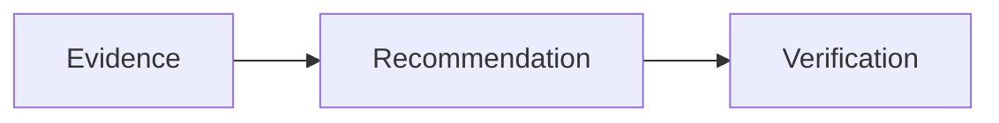

<!-- SPDX-License-Identifier: MIT -->
<!-- SPDX-FileCopyrightText: 2025-2026 Marcus Quinn -->

# LLM Visibility Report

::: report-cover
**Evidence-first AI search reporting** for AIO, Gemini, ChatGPT, AI Mode, and Perplexity.

Report date: 2026-05-23. Scope: sample renderer fixture.
:::

## Executive Summary {{badge:strong}}

The site appears in AI Overviews and answer-engine citations for priority service prompts. {{evidence:verified}}

Read the [source ledger](#evidence-ledger) before assigning roadmap items.

Inline math example: {{latex:citation\_lift = verified\_mentions / prompts}}.

::: badge-row
{{evidence:verified}} {{evidence:partial}} {{evidence:inferred}} {{evidence:missing}}
:::

::: badge-key
{{badge:rct}} Controlled study.

{{badge:strong}} Strong primary data.

{{badge:hygiene}} Technical hygiene.
:::

::: stats-strip
::: stat-card
**82**

AIO citation score.
:::
::: stat-card
**5**

Answer engines tracked separately.
:::
::: stat-card
**12**

Source IDs in the ledger.
:::
::: stat-card
**3**

Priority page types weighted.
:::
:::

::: action-line
**Next action:** strengthen evidence cards on comparison and research pages before rerunning prompt tests.
:::

::: accordion title="Method detail"
1. Collect source IDs.
2. Map findings to page type.
3. Re-run engine prompts separately.
:::

## Method

- Run SEO AI readiness across AIO, Gemini, ChatGPT, AI Mode, and Perplexity.
- Capture prompts, source IDs, screenshots, crawl exports, and remediation notes.

::: details-note
### Method note

FAQPage schema is treated as hygiene. Visibility recommendations are weighted by page type and verified per engine.
:::

::: info-panel severity=high
### Priority note

Fix retrieval blockers before optional schema work.
:::

## Weighted Scorecard

::: facts-table-wrap

| Component | Score | Badge |
|---|---:|---|
| AIO | 82 | {{evidence:verified}} |
| Gemini | 74 | {{evidence:partial}} |
| ChatGPT | 68 | {{evidence:inferred}} |
| AI Mode | 51 | {{evidence:partial}} |
| Perplexity | 0 | {{evidence:missing}} |
:::

::: myth-callout
### Myth

Adding FAQPage schema alone is a primary GEO tactic.

### Fact

FAQPage is hygiene unless visible FAQ content genuinely matches query fan-out and page type.
:::

## Page-Type Findings

- Product detail pages include source-backed claims. {{evidence:verified}}
- Comparison pages need stronger evidence cards. {{evidence:partial}}
- Research pages have inferred opportunity clusters. {{evidence:inferred}}

::: good-bad
::: good-row
### Good pattern

Lead with a direct answer, source ID, author, update date, and supporting data table.
:::
::: bad-row
### Weak pattern

Hide the answer behind client-side rendering or unsupported claims.
:::
:::

::: tactic-card
### Direct-answer opening

- What: answer the query plainly in the first paragraph.
- Why: extractive answer systems need concise, quotable claims with nearby proof.
- Verify: rerun per-engine prompts and compare cited URL movement.
:::

::: example-card
```text
Question: What evidence proves this claim?
Answer: Cite source ID S-004, report date, owner, and page URL.
```
:::

::: example-card title="Mermaid fallback"

:::

::: block-template title="Author block template"
```text
Written by Dr. Jane Doe, PhD
Principal Data Scientist, ExampleCo
```
:::

::: bar-chart
Evidence coverage — 72%
Retrieval readiness — 64%
Corroboration — 51%
:::

::: industry-card
### SaaS comparison pages

Prioritise third-party corroboration, clear feature tables, and source-backed claims.
:::

::: case-study-card
### Sample case study

**Result:** comparison-page citations increased after source-backed tables, expert review, and profile parity fixes.

**Tactics applied:** visible methodology, direct answer, third-party corroboration, and monthly prompt reruns.
:::

::: priority-group priority=high
### High priority remediation

Refresh weak comparison pages with source cards and visible evidence summaries.
:::

::: checklist-card
### Verification checklist

- [x] AIO prompt rerun captured.
- [x] Gemini source export saved.
- [ ] ChatGPT transcript linked to source IDs.
- [ ] Perplexity gap recorded when no citation appears.
:::

> Keep observed evidence separate from interpretation.

## Evidence Ledger

::: sources-layout
::: sources-group
::: source-title
Prompt evidence
:::
Source: AIO capture and crawl export for priority prompts.
Source card: Gemini citation export and manual verification worksheet.
:::
::: sources-group
::: source-title
Gap evidence
:::
Source: ChatGPT prompt transcript with source IDs.
Source card: Perplexity query set showing missing citation coverage.
:::
:::

::: source-list
::: source-item
### Source S-001
Prompt capture with per-engine source IDs and recheck date.
:::
::: source-item
### Source S-002
Crawl export showing visible answer blocks and source proximity.
:::
:::

::: source-card
### Source S-004

Manual prompt capture, crawl export, screenshot, and remediation note.
:::

## Roadmap

- Add cited source cards to weak pages.
- Rerun `/seo-ai-readiness example.com` after remediation.

## Verification

- Render this Markdown fixture to HTML.
- Print or export the HTML to PDF from the browser print dialog.

::: version-summary
V4 · compiled May 2026 · internal toolkit
:::

::: appendix-links
[Source ledger](appendices/source-ledger.md) [Rendered report](report.html) [Export bundle](report.pdf)
:::
