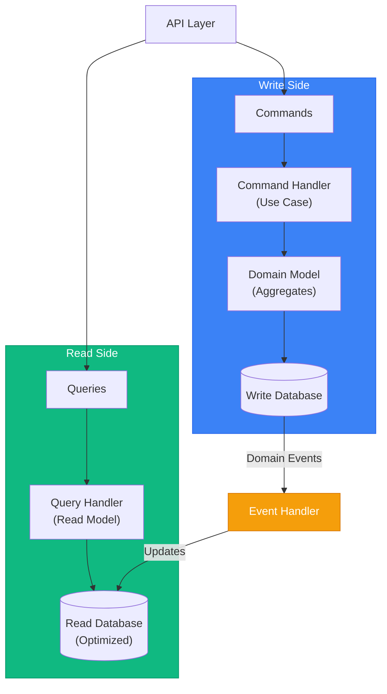

# CQRS & Domain Events

> Sources: [CQRS](https://martinfowler.com/bliki/CQRS.html) — Fowler | [Event Sourcing](https://martinfowler.com/eaaDev/EventSourcing.html) — Fowler | [CQRS Pattern](https://learn.microsoft.com/en-us/azure/architecture/patterns/cqrs) — Microsoft | [Transactional Outbox](https://microservices.io/patterns/data/transactional-outbox.html) — microservices.io | [Domain Events – Salvation](https://udidahan.com/2009/06/14/domain-events-salvation/) — Dahan | [Domain Events: Design and Implementation](https://learn.microsoft.com/en-us/dotnet/architecture/microservices/microservice-ddd-cqrs-patterns/domain-events-design-implementation) — Microsoft

## CQRS Overview

**Command Query Responsibility Segregation** — separate read and write models.



## Commands vs Queries

**Commands** mutate state; **queries** retrieve data without side effects.

```typescript
// Command handler — write side (mutates state, publishes events)
export class PlaceOrderHandler {
  async handle(cmd: PlaceOrderCommand): Promise<OrderId> {
    const order = Order.create(CustomerId.from(cmd.customerId));
    for (const item of cmd.items) order.addItem((await this.productRepo.findById(item.productId)).id, item.quantity);
    await this.orderRepo.save(order);
    await this.eventPublisher.publishAll(order.domainEvents);
    return order.id;
  }
}

// Query handler — read side (never mutates state)
export class GetOrderHandler {
  async handle(query: { orderId: string }): Promise<OrderDTO | null> {
    return this.readDb.findById(query.orderId);
  }
}
```

Read model is denormalized and query-optimized. Start with the same DB and separate query paths; split databases only when proven necessary.

## Domain Events

Notifications that something happened — used for read model updates, cross-aggregate communication, and bounded context integration.

```typescript
export abstract class DomainEvent {
  readonly eventId = crypto.randomUUID();
  readonly occurredAt = new Date();
  abstract readonly eventType: string;
  constructor(readonly aggregateId: string) {}
  abstract toPayload(): Record<string, unknown>;
}

// Concrete event — carries only what changed
export class OrderConfirmed extends DomainEvent {
  readonly eventType = 'order.confirmed';
  constructor(readonly orderId: OrderId, readonly total: Money, readonly items: ReadonlyArray<{ productId: string; quantity: number }>) { super(orderId.value); }
  toPayload() { return { orderId: this.orderId.value, total: { amount: this.total.amount, currency: this.total.currency }, items: this.items }; }
}
```

```
class OrderConfirmedHandler:
    handle(event: OrderConfirmed):
        db.ordersRead.where(id: event.orderId.value).update({ status: "confirmed", total: event.total.amount, confirmedAt: event.occurredAt })
```

## Domain Events vs Integration Events

| | Domain Events | Integration Events |
|--|--------------|-------------------|
| Scope | Within bounded context | Cross bounded context |
| Granularity | Fine-grained, low-level | Coarser-grained |
| Transport | In-process | Message broker |
| Schema | Internal | Versioned |

A domain event handler fetches the aggregate and publishes a versioned integration event to the message broker:

```typescript
export class PublishOrderConfirmedIntegrationEvent {
  async handle(domainEvent: OrderConfirmed): Promise<void> {
    const order = await this.orderRepo.findById(domainEvent.orderId);
    if (!order) return;
    await this.messageBroker.publish('order-events', {
      eventType: 'sales.order.confirmed', eventId: crypto.randomUUID(), version: '1.0',
      occurredAt: new Date().toISOString(),
      payload: { orderId: order.id.value, customerId: order.customerId.value,
        total: { amount: order.total.amount, currency: order.total.currency },
        items: order.items.map(i => ({ productId: i.productId.value, quantity: i.quantity.value, unitPrice: i.unitPrice.amount })),
      },
    });
  }
}
```

## Event Dispatcher Pattern

Routes events to registered handlers; supports multiple handlers per event type (fan-out).

```typescript
export class EventDispatcher {
  private handlers: Map<string, IEventHandler<any>[]> = new Map();
  register<T extends DomainEvent>(eventType: string, handler: IEventHandler<T>): void {
    this.handlers.set(eventType, [...(this.handlers.get(eventType) ?? []), handler]);
  }
  async dispatch(event: DomainEvent): Promise<void> {
    await Promise.all((this.handlers.get(event.eventType) ?? []).map(h => h.handle(event)));
  }
  async dispatchAll(events: DomainEvent[]): Promise<void> {
    for (const event of events) await this.dispatch(event);
  }
}

// One event type can have multiple handlers (fan-out)
dispatcher.register('order.confirmed', new OrderConfirmedHandler(readDb));
dispatcher.register('order.confirmed', new PublishOrderConfirmedIntegrationEvent(broker, orderRepo));
```

## Outbox Pattern

Guarantees reliable event publishing: write events to an outbox table in the **same transaction** as the aggregate, then publish asynchronously.

```
// In command handler — single transaction
db.transaction((tx) => {
    orderRepo.save(order, tx)
    for event in order.domainEvents:
        tx.outbox.insert({ id: event.eventId, eventType: event.eventType, payload: serialize(event.toPayload()), createdAt: event.occurredAt })
})

// Background processor
class OutboxProcessor:
    process():
        messages = db.outbox.where(processedAt: null).orderBy("createdAt").limit(100).lockForUpdate()
        for message in messages:
            messageBroker.publish(message.eventType, message.payload)
            db.outbox.where(id: message.id).update({processedAt: now()})
```

## When to Use CQRS

> **Warning:** "You should be very cautious about using CQRS... the majority of cases I've run into have not been so good." — Martin Fowler

**Use when:** Read/write workloads have dramatically different scaling requirements; complex queries don't map well to the domain model; event sourcing is used; simpler approaches are proven insufficient.

**Skip when:** Simple CRUD; similar read/write patterns; small team or simple domain; adding "just in case".

**CQRS applies to specific bounded contexts, never entire systems.**

## Event Sourcing: Critical Considerations

> **Warning:** "Extremely difficult to add Event Sourcing to systems not originally designed for it." — Martin Fowler

**Use when:** Complete audit trail is a business requirement; need to reconstruct state at any point in time; domain is inherently event-driven (financial transactions, workflows).

**Avoid when:** Simple CRUD with no audit requirements; team unfamiliar with event-driven patterns; adding retroactively; no clear business need for temporal queries.

**Requirements:**
1. **Events must store deltas** — not final state, but what changed (enables reversal)
2. **Snapshots for performance** — rebuild from snapshots, not from event 0
3. **External system handling** — disable notifications during replays; cache external query results with timestamps
4. **Schema evolution strategy** — events are forever; plan for versioning

## Saga Pattern (Cross-Aggregate Workflows)

Use sagas for workflows spanning multiple aggregates — not raw domain event coordination.

```
Saga: PlaceOrderSaga
├── Step 1: Reserve inventory (Inventory aggregate)
├── Step 2: Process payment (Payment aggregate)
├── Step 3: Confirm order (Order aggregate)
└── Compensating actions if any step fails
```

- **Choreography:** Each service listens/publishes events (simpler, harder to trace)
- **Orchestration:** Central coordinator manages steps (explicit, easier to debug)

## Idempotent Consumer Pattern

**Required for reliable event processing** — messages may be delivered more than once.

```
class OrderConfirmedHandler:
    processedIds: Set<string>

    handle(event: OrderConfirmed):
        if event.eventId in processedIds: return
        doWork(event)
        processedIds.add(event.eventId)
```

**Implementation options:** Store processed message IDs in database; use message broker's deduplication features; design handlers to be naturally idempotent.
