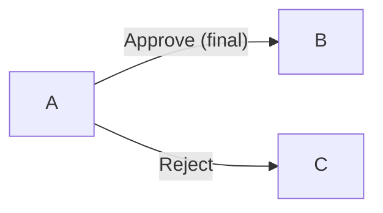
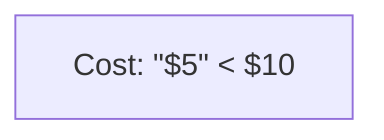

<!-- SPDX-License-Identifier: MIT -->
<!-- SPDX-FileCopyrightText: 2025-2026 Marcus Quinn -->

# Mermaid Diagrams — Pitfalls

Diagrams render in GitHub, GitLab, VS Code, Obsidian, Notion. Models already know the
diagram types (`flowchart`, `sequenceDiagram`, `erDiagram`, `classDiagram`,
`stateDiagram-v2`, `gantt`, `journey`, `gitGraph`, `pie`, `quadrantChart`); this page
covers only the syntax mistakes smaller models actually hit.

## Edge-label quoting

Quote edge labels that contain `|`, `#`, or punctuation — an unquoted label breaks
the parser at the first special character:

## Reserved words

`end` (lowercase) closes `subgraph`, `alt`, `opt`, `loop`, `par`, and `critical`
blocks. A node or state literally named `end` breaks parsing — capitalize it
(`End`) or quote it: `["End"]`.

## Special characters in node text

Escape `"`, `#`, `<`, `>`, `{`, `}` inside node labels with HTML entities, or wrap
the whole label in quotes:

Unescaped `{`/`}` inside flowchart node text is read as a new node shape, not
literal text — this is the most common silent-failure case.

## Subgraph IDs

Give every `subgraph` an explicit ID (`subgraph client [Client Layer]`) instead
of relying on the title text as the ID. Untitled/duplicate-title subgraphs
collide and links between them silently fail to resolve.

## Renderer differences: GitHub vs mermaid-cli

- GitHub is stricter about trailing semicolons inside `erDiagram` attribute
  blocks than `mermaid-cli`/Mermaid Live — omit them.
- `%%{init: ...}%%` theme directives render in mermaid-cli and VS Code but
  GitHub's built-in renderer ignores them.
- GitHub caps diagram complexity — large `erDiagram`/`classDiagram` graphs can
  render blank with no error; split oversized diagrams instead of debugging one.
- Validate in the [Mermaid Live Editor](https://mermaid.live) first; valid
  there but blank on GitHub is almost always one of the above.

**Resources:** [mermaid.js.org](https://mermaid.js.org) ·
[mermaid.live](https://mermaid.live) ·
[github.com/mermaid-js/mermaid](https://github.com/mermaid-js/mermaid)
