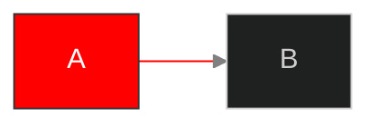

# Mermaid Quick Reference Cheatsheet

## Diagram Declarations

| Diagram | Declaration | Diagram | Declaration |
|---------|-------------|---------|-------------|
| Flowchart | `flowchart LR` / `TB` | Sequence | `sequenceDiagram` |
| Class | `classDiagram` | ER | `erDiagram` |
| State | `stateDiagram-v2` | User Journey | `journey` |
| Gantt | `gantt` | Pie | `pie` / `pie showData` |
| Mindmap | `mindmap` | Timeline | `timeline` |
| Git Graph | `gitGraph` | C4 Context | `C4Context` |
| C4 Container | `C4Container` | C4 Component | `C4Component` |
| Architecture | `architecture-beta` | Block | `block-beta` |
| Quadrant | `quadrantChart` | XY Chart | `xychart-beta` |
| Sankey | `sankey-beta` | Kanban | `kanban` |
| Packet | `packet-beta` | Requirement | `requirementDiagram` |
| Treemap | `treemap-beta` | | |

## Flowchart

Direction: `TB`/`TD` (top-bottom) · `BT` · `LR` · `RL`

```text
A[Rectangle]       B(Rounded)         C([Stadium])
D[[Subroutine]]    E[(Database)]      F((Circle))
G{Diamond}         H{{Hexagon}}       I[/Parallelogram/]
J(((Double)))

A --> B       Solid arrow         A --- B       Solid line
A -.-> B      Dotted arrow        A ==> B       Thick arrow
A --o B       Circle end          A --x B       Cross end
A <--> B      Bidirectional       A -->|text| B Labeled
```

Subgraph: `subgraph Name ... end` (nestable, linkable between subgraphs)

## Sequence Diagram

```text
A->>B     Solid arrow (sync)      A-->>B    Dotted arrow (response)
A-xB      Failed message          A-)B      Async message
A->>+B: Request    Activate B     B-->>-A: Response  Deactivate B

alt Condition          opt Optional           loop Every 30s
    A->>B: If true         A->>B: Maybe           A->>B: Repeat
else                   end                    end
    A->>B: If false
end
par Parallel               Note right of A: Text
    A->>B: Task 1          Note over A,B: Spanning note
and
    A->>C: Task 2
end
```

## Class Diagram

Visibility: `+` Public · `-` Private · `#` Protected · `~` Package

```text
A <|-- B    Inheritance      A *-- B     Composition
A o-- B     Aggregation      A --> B     Association
A ..> B     Dependency       A ..|> B    Realization

A "1" --> "*" B : has         A "0..1" --> "1..*" B
class A { <<interface>>    +method() }
class B { <<enumeration>>  VALUE1    }
```

## ER Diagram

```text
||--||    One to one         ||--o{    One to many
}o--o{    Many to many (opt) }|--|{    Many to many (req)
--    Identifying (solid)    ..    Non-identifying (dashed)
ENTITY { type name PK     type name FK     type name UK     type name }
```

## State Diagram

```text
[*] --> State1          state Parent {        state check <<choice>>
State1 --> State2           [*] --> Child1    A --> check
State2 --> [*]              Child1 --> Child2 check --> B : cond1
State1 --> State1       }                     check --> C : cond2

state fork <<fork>>    state join <<join>>
[*] --> fork           fork --> A    fork --> B
A --> join             B --> join    join --> [*]
```

## Gantt Chart

```text
Task name : [tags], [id], [start], [end/duration]
Completed   :done, t1, 2024-01-01, 7d       Active    :active, t2, after t1, 5d
Critical    :crit, t3, 2024-01-15, 3d       Milestone :milestone, m1, 2024-01-20, 0d
after taskId          after t1 t2    (multiple dependencies)
```

## Pie Chart / Timeline

```text
pie showData                    timeline
    title Chart Title               title Title
    "Label 1" : 42                  section Period
    "Label 2" : 28                      Date : Event 1 : Event 2
```

## C4 Diagrams

```text
Person(alias, "Label", "Description")
System(alias, "Label", "Description")       System_Ext(alias, "Label", "Description")
Container(alias, "Label", "Tech", "Desc")   ContainerDb(alias, "Label", "Tech", "Desc")
Component(alias, "Label", "Tech", "Desc")
Rel(from, to, "Label")    Rel(from, to, "Label", "Tech")    BiRel(from, to, "Label")
System_Boundary(alias, "Label") { Container(...) }
```

## Architecture Diagram

```text
group id(icon)[Title]               group id(icon)[Title] in parent
service id(icon)[Title]             service id(icon)[Title] in group
a:R --> L:b     a:T --> B:b     <-->  Bidirectional
```

Icons: `cloud`, `database`, `disk`, `internet`, `server`

## Styling



Themes: `default` · `dark` · `forest` · `neutral` · `base`

Theme variables: `%%{init: {'theme': 'base', 'themeVariables': {'primaryColor': '#3b82f6', 'lineColor': '#64748b'}}}%%`

## Special Characters

| Char | Escape | Char | Escape | Char | Escape |
|------|--------|------|--------|------|--------|
| `"` | `#quot;` | `#` | `#35;` | `<` | `#lt;` |
| `>` | `#gt;` | `{` | `#123;` | `}` | `#125;` |

## Quick Decision Guide

| Need | Use | Need | Use |
|------|-----|------|-----|
| Process flow | Flowchart | API interactions | Sequence |
| OOP design | Class | Database schema | ER |
| State machine | State | UX mapping | User Journey |
| Project timeline | Gantt | Data distribution | Pie |
| Brainstorming | Mindmap | Chronology | Timeline |
| Git branches | Git Graph | System architecture | C4 / Architecture |
| Priority matrix | Quadrant | Data trends | XY Chart |
| Flow allocation | Sankey | Task board | Kanban |
| Protocol structure | Packet | Requirements | Requirement |

**Resources:** [Live Editor](https://mermaid.live) · [Docs](https://mermaid.js.org) · [GitHub](https://github.com/mermaid-js/mermaid)
