# Architecture Diagrams

Mermaid provides several diagram types for system architecture: Architecture diagrams, Block diagrams, C4 diagrams, Kanban boards, Packet diagrams, and Requirement diagrams.

---

## Architecture Diagrams

Cloud and CI/CD infrastructure visualization using icons and groups.

### Basic Syntax

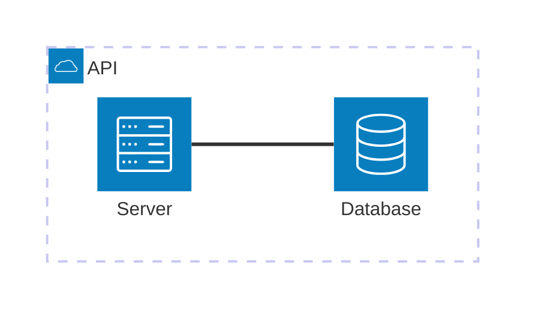

### Components

**Groups** — organize services logically:

```
group {id}({icon})[{title}]
group {id}({icon})[{title}] in {parent_id}
```

**Services** — individual components:

```
service {id}({icon})[{title}]
service {id}({icon})[{title}] in {group_id}
```

**Junctions** — 4-way connection points:

```
junction {id}
junction {id} in {group_id}
```

### Edges

```
{service}:{direction} {arrow} {direction}:{service}
```

| Direction | Code | Arrow Types | Syntax |
|-----------|------|-------------|--------|
| Top | `T` | Undirected | `--` |
| Bottom | `B` | Right | `-->` |
| Left | `L` | Left | `<--` |
| Right | `R` | Bidirectional | `<-->` |

### Icons

Default: `cloud`, `database`, `disk`, `internet`, `server`

Iconify (200,000+ icons): `logos:aws`, `logos:google-cloud`, etc.

### Example: Microservices Architecture

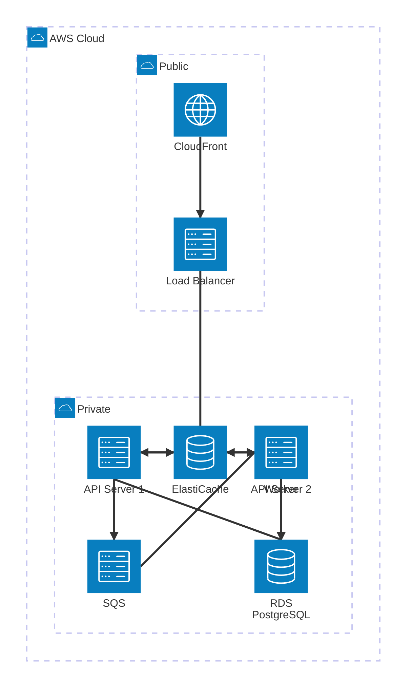

---

## Block Diagrams

System component layouts with flexible positioning.

### Syntax

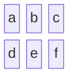

**Block width (spanning):** `a:1 b:2 c:3`

**Shapes:**

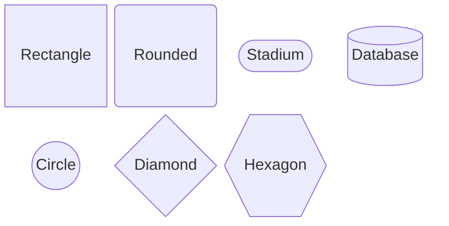

**Nested blocks:**

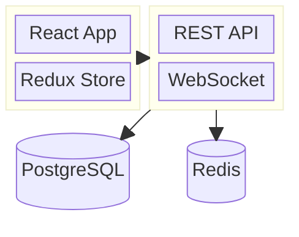

**Styling:**

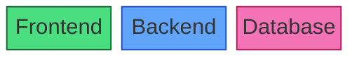

### Example: Three-Tier Architecture

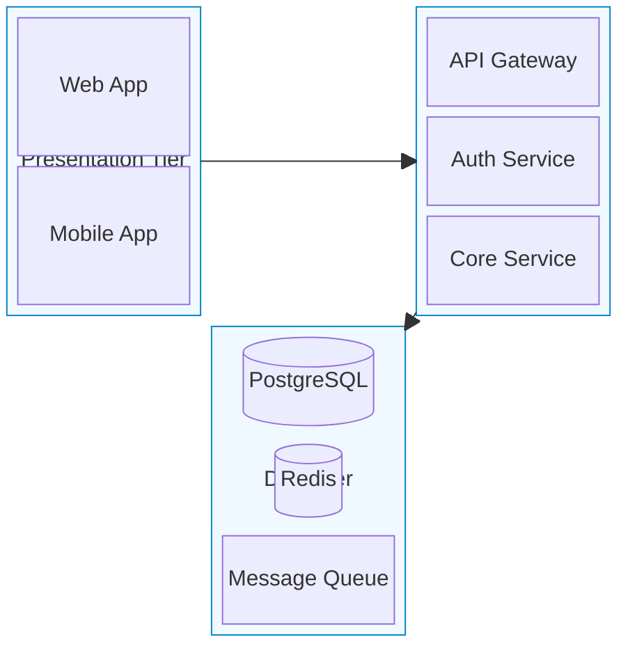

---

## C4 Diagrams

Software architecture using the C4 model (Context, Container, Component, Code).

| Type | Declaration | Level |
|------|-------------|-------|
| System Context | `C4Context` | 1 — Highest |
| Container | `C4Container` | 2 |
| Component | `C4Component` | 3 |
| Dynamic | `C4Dynamic` | Interactions |
| Deployment | `C4Deployment` | Infrastructure |

### C4Context (Level 1)

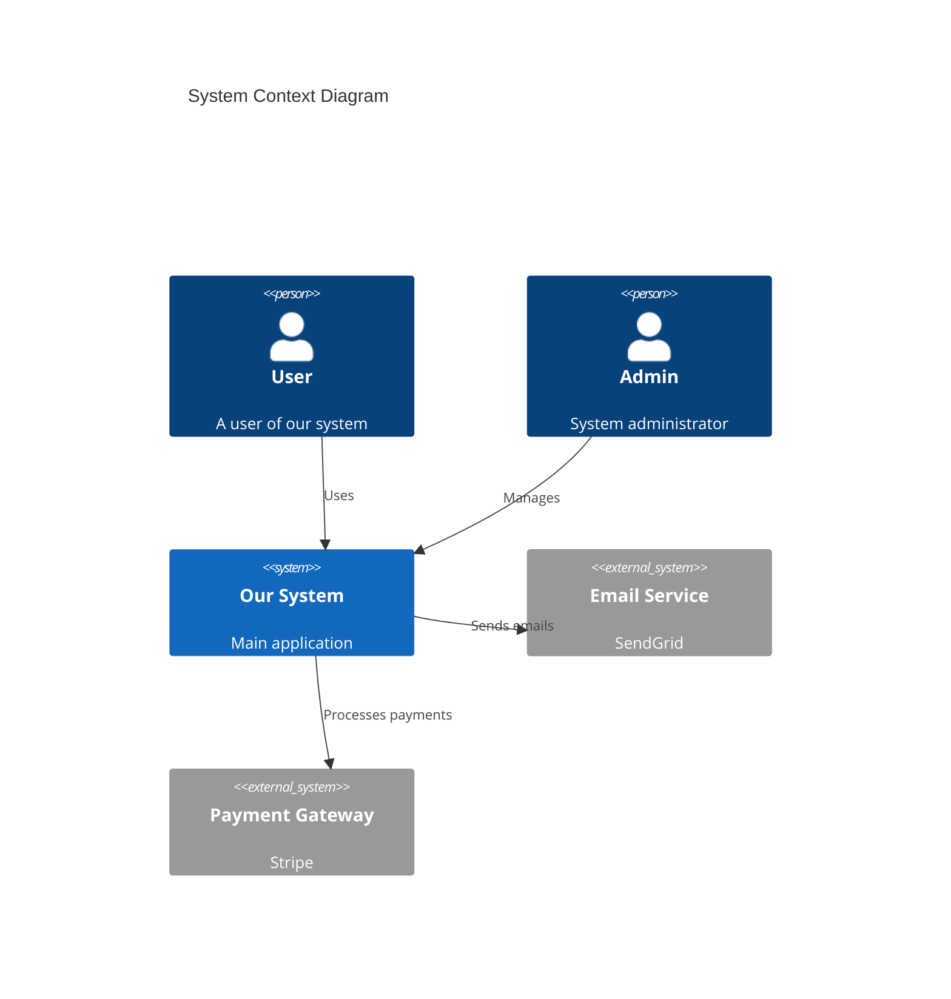

**Elements:** `Person`, `Person_Ext`, `System`, `System_Ext`, `SystemDb`, `SystemQueue`, `Boundary`, `Enterprise_Boundary`

### C4Container (Level 2)

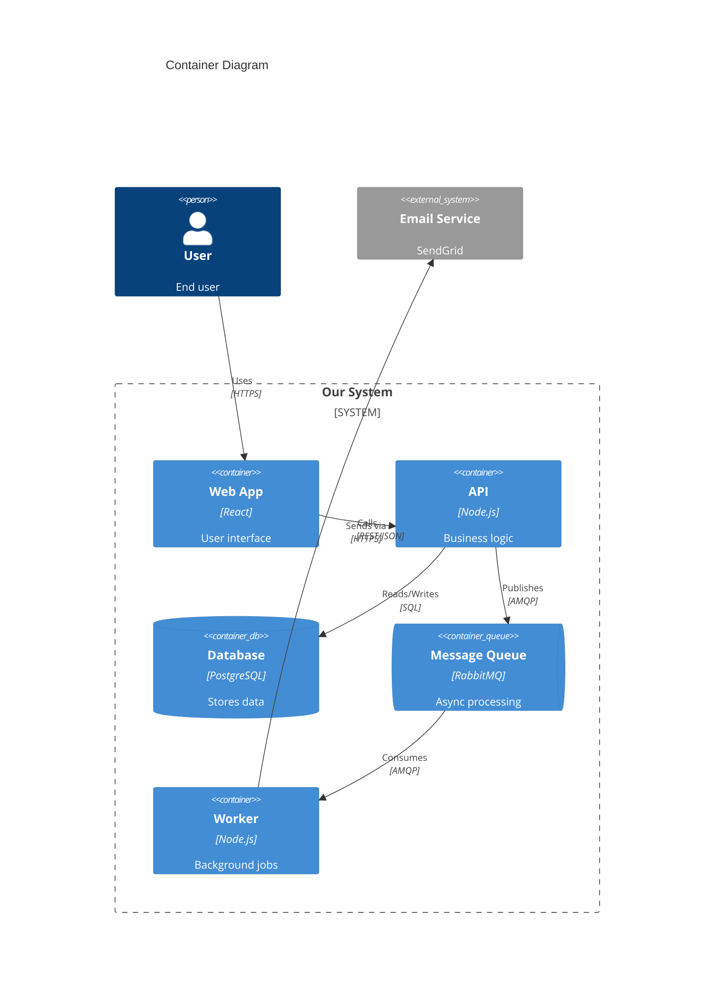

**Container elements:** `Container`, `Container_Ext`, `ContainerDb`, `ContainerQueue`, `Container_Boundary`

### C4Component (Level 3)

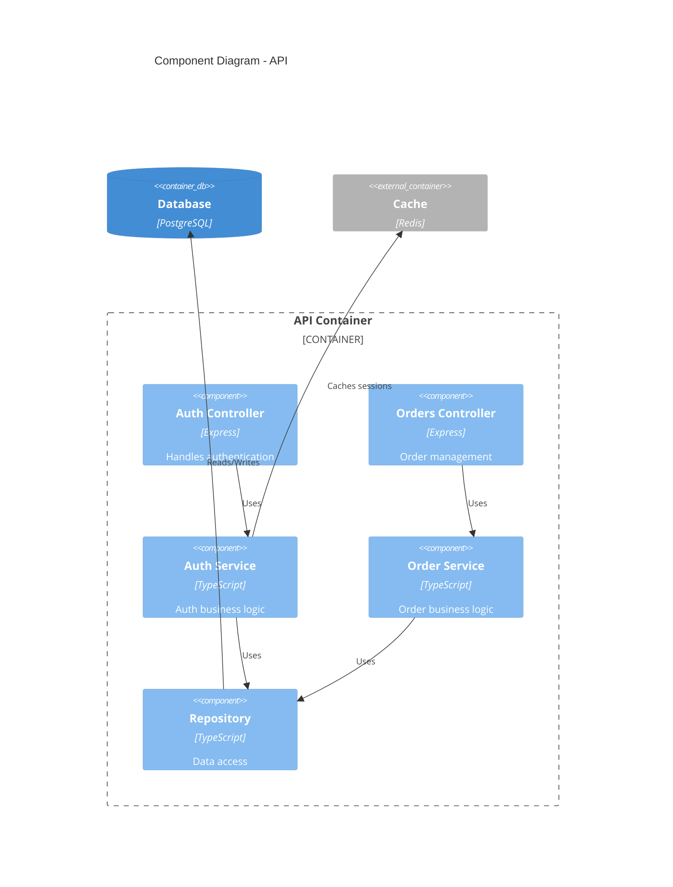

### C4Dynamic & C4Deployment

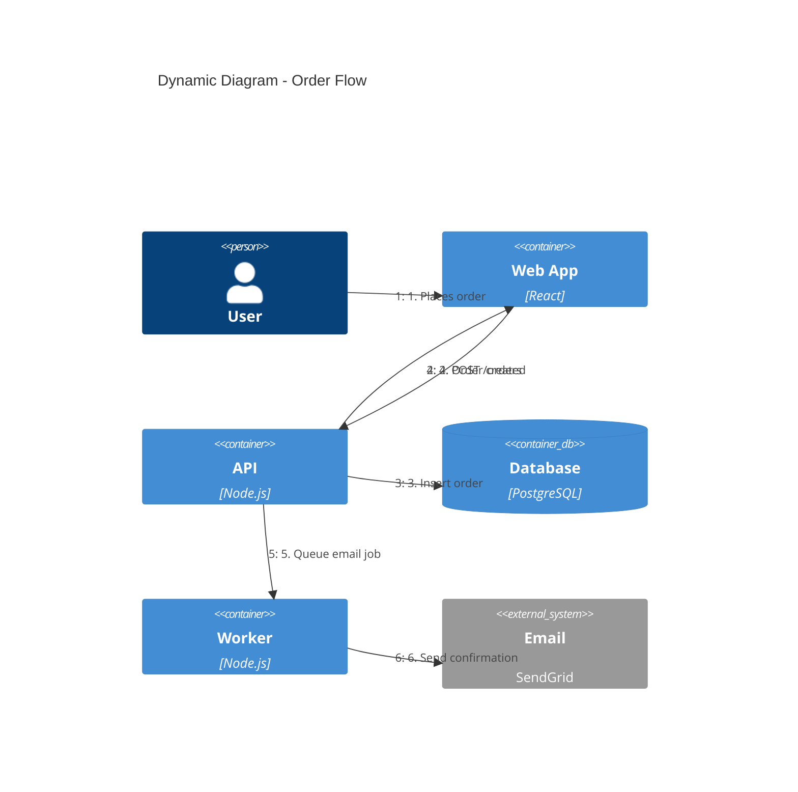

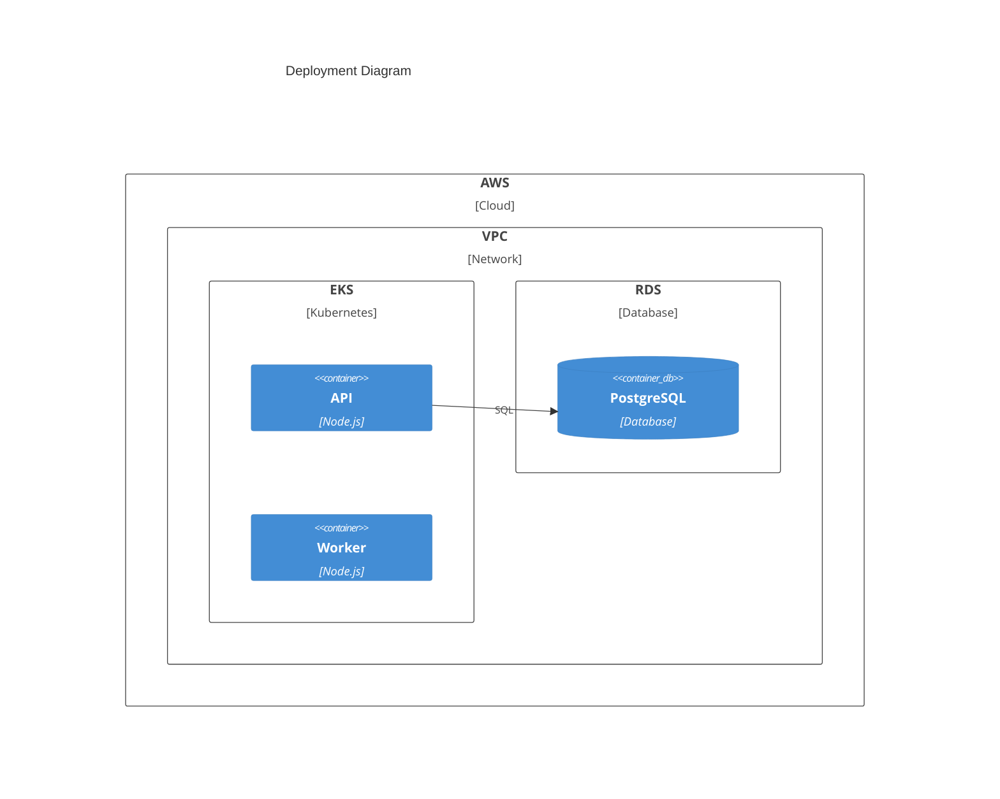

**Relationships:** `Rel(from, to, label[, tech])`, `BiRel()`, `Rel_U/D/L/R()`, `Rel_Back()`

**Styling:** `UpdateElementStyle(alias, $fontColor, $bgColor)`, `UpdateRelStyle(from, to, $textColor, $lineColor)`

---

## Kanban Diagrams

```mermaid
kanban
    Backlog
        story1[User login]
        story2[Password reset]
    Todo
        task1[Design login form]
        @{ ticket: AUTH-123 }
        @{ assigned: alice }
        @{ priority: High }
    In Progress
        task2[Implement login API]
        @{ assigned: bob }
    Done
        task3[Project setup]
```

**Metadata keys:** `ticket`, `assigned`, `priority`

**Config:**

```yaml
---
config:
  kanban:
    ticketBaseUrl: 'https://jira.example.com/browse/#TICKET#'
---
```

---

## Packet Diagrams

Network protocol visualization.

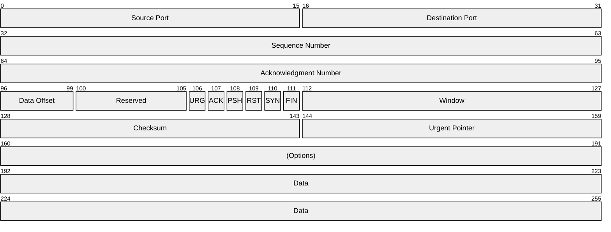

**Bit ranges:** Absolute `0-15: "Field"` or relative `+16: "Field"` (16 bits from current position).

---

## Requirement Diagrams

System requirements and traceability.

**Requirement types:** `requirement`, `functionalRequirement`, `interfaceRequirement`, `performanceRequirement`, `physicalRequirement`, `designConstraint`

**Relationships:** `contains`, `copies`, `derives`, `satisfies`, `verifies`, `refines`, `traces`

```mermaid
requirementDiagram

    requirement auth_system {
        id: REQ-100
        text: System shall provide user authentication
        risk: high
        verifymethod: test
    }

    functionalRequirement login {
        id: REQ-101
        text: Users can log in with email/password
        risk: medium
        verifymethod: test
    }

    functionalRequirement mfa {
        id: REQ-102
        text: System shall support MFA
        risk: high
        verifymethod: demonstration
    }

    element auth_service {
        type: service
        docref: SVC-001
    }

    element auth_tests {
        type: test_suite
        docref: TEST-001
    }

    auth_system - contains -> login
    auth_system - contains -> mfa
    auth_service - satisfies -> login
    auth_service - satisfies -> mfa
    auth_tests - verifies -> login
    auth_tests - verifies -> mfa
```
