# Flowchart Diagrams

Flowcharts visualize processes, algorithms, and decision flows using nodes and edges.

## Basic Syntax

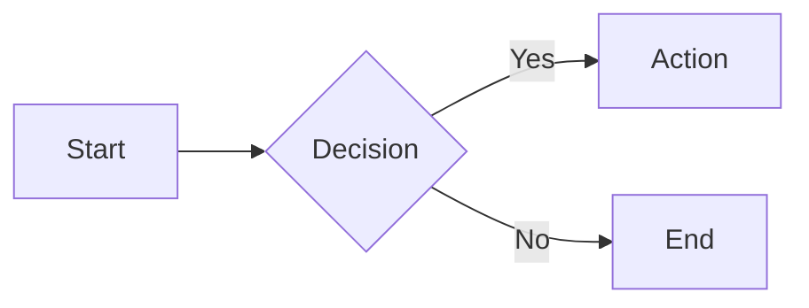

## Direction

| Declaration | Direction |
|-------------|-----------|
| `TB` / `TD` | Top to Bottom |
| `BT` | Bottom to Top |
| `LR` | Left to Right |
| `RL` | Right to Left |

## Node Shapes

### Standard Shapes

```
A[Rectangle]         Default box
B(Rounded)           Rounded corners
C([Stadium])         Pill shape
D[[Subroutine]]      Double vertical lines
E[(Database)]        Cylinder
F((Circle))          Circle
G{Diamond}           Decision/rhombus
H{{Hexagon}}         Hexagon
I[/Parallelogram/]   Slanted right
J[\Parallelogram\]   Slanted left
K[/Trapezoid\]       Trapezoid
L[\Trapezoid/]       Inverted trapezoid
M(((Double Circle))) Double circle
```

### Extended Shapes (v11.3+)

Syntax: `node@{ shape: name, label: "Text" }`

| Shape | Description | Shape | Description |
|-------|-------------|-------|-------------|
| `rect` | Rectangle | `rounded` | Rounded rectangle |
| `stadium` | Pill | `subroutine` | Subroutine box |
| `cyl` | Cylinder (DB) | `circle` | Circle |
| `dbl-circ` | Double circle | `diamond` | Diamond |
| `hex` | Hexagon | `lean-r` / `lean-l` | Parallelogram |
| `trap-b` / `trap-t` | Trapezoid | `doc` | Document |
| `bolt` | Lightning bolt | `tri` | Triangle |
| `fork` | Fork | `hourglass` | Hourglass |
| `flag` | Flag | `comment` | Comment |
| `f-circ` | Filled circle | `lin-cyl` | Lined cylinder |
| `brace` / `brace-r` / `braces` | Curly brace(s) | `win-pane` | Window pane |
| `notch-rect` | Notched rect | `bow-rect` | Bow tie rect |
| `div-rect` | Divided rect | `odd` | Odd shape |
| `lin-doc` | Lined document | `tag-doc` / `tag-rect` | Tagged shapes |
| `half-rounded-rect` | Half rounded | `curv-trap` | Curved trapezoid |

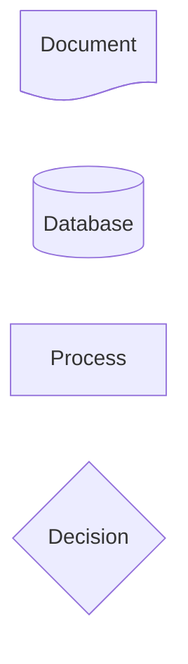

## Edge Types

```
A --> B       Solid arrow
A --- B       Solid line (no arrow)
A -.-> B      Dotted arrow
A -.- B       Dotted line
A ==> B       Thick arrow
A === B       Thick line
A --o B       Circle end
A --x B       Cross end
A o--o B      Circle both ends
A x--x B      Cross both ends
A <--> B      Arrows both ends
```

**Edge length** — extra dashes extend: `A --> B` (normal), `A ---> B` (longer), `A ----> B` (even longer)

**Labels:**

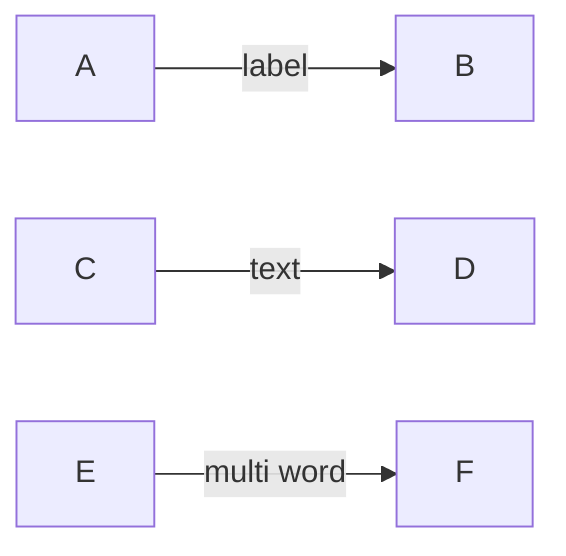

**Animation (v11+):** `A e1@--> B` then `e1@{ animate: true, animation-duration: "0.5s" }`

## Subgraphs

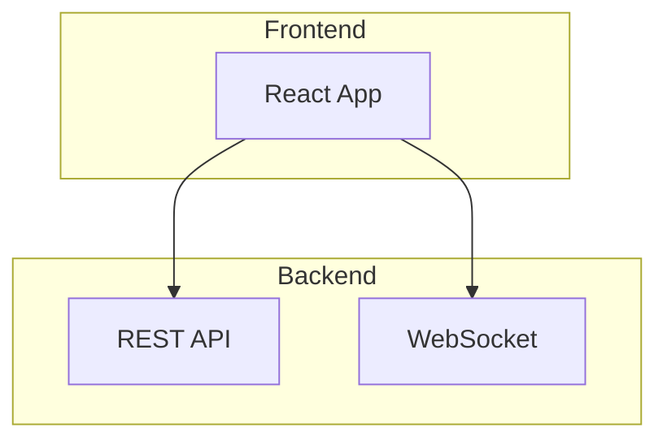

**Nested subgraphs** — subgraphs can contain subgraphs. **Per-subgraph direction** — add `direction TB` inside a subgraph to override flow direction locally.

## Multi-Target Edges

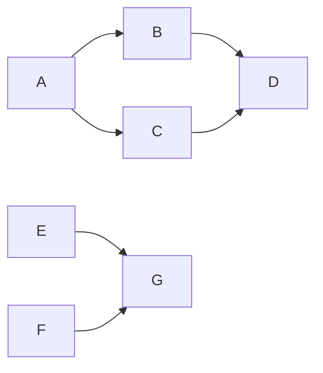

## Markdown in Labels

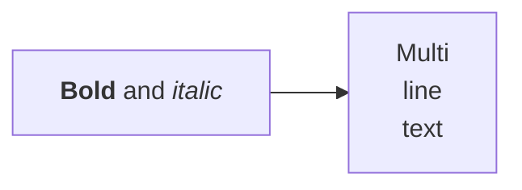

## Icons

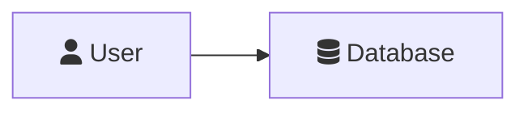

## Click Events

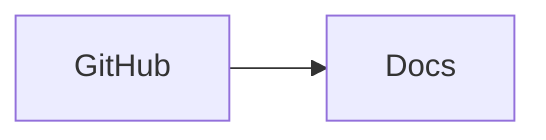

## Styling

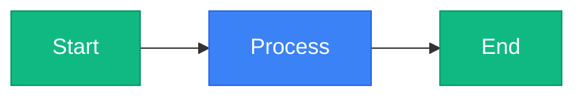

**Individual node and link styles:**

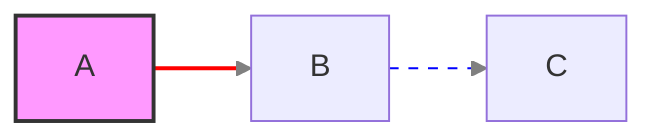

## Layout Engine

ELK for complex diagrams (v9.4+):

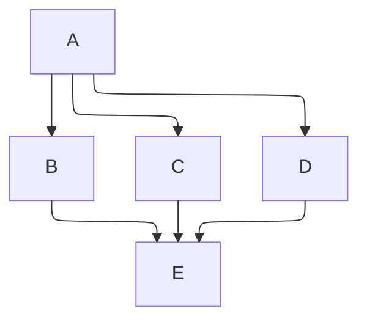

## Examples

### Decision Tree

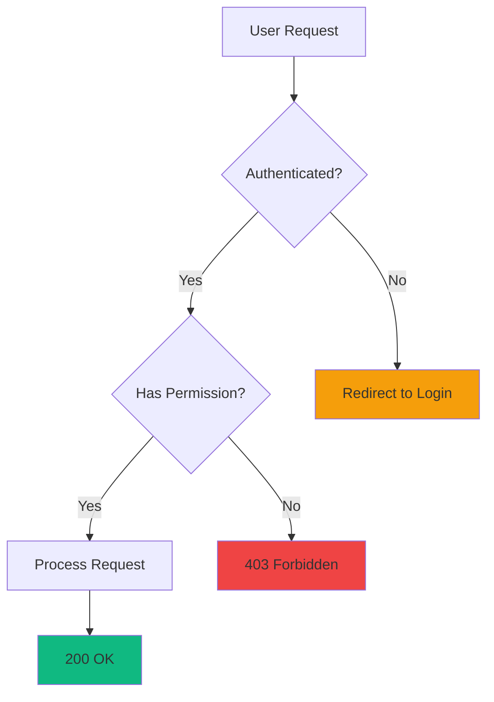

### CI/CD Pipeline

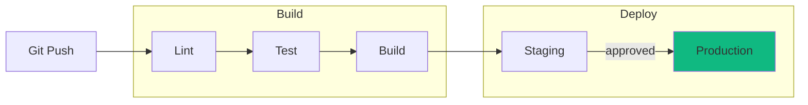
