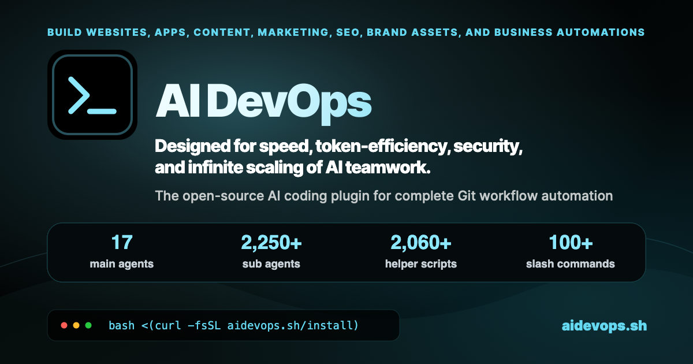
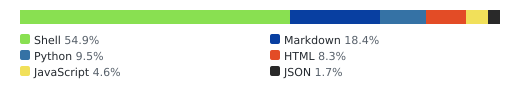
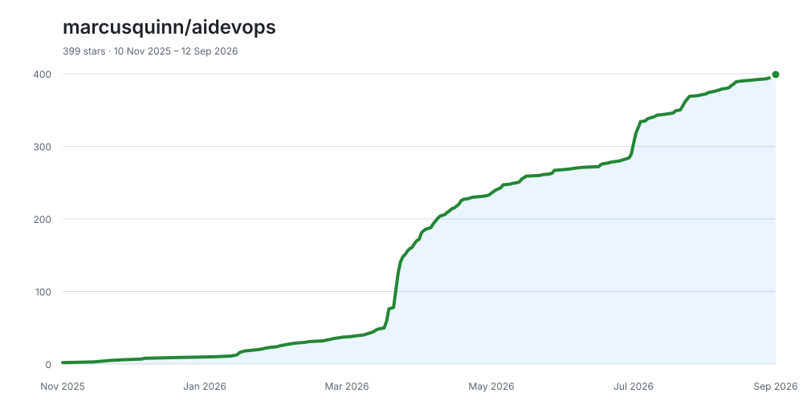

<!-- SPDX-License-Identifier: MIT -->
<!-- SPDX-FileCopyrightText: 2025-2026 Marcus Quinn -->



# AI DevOps Framework

**[aidevops.sh](https://aidevops.sh)** is an [OpenCode](https://opencode.ai/)
plugin and AI DevOps framework for carrying work from intent to a verified
outcome. It combines specialist agents, durable repository knowledge, safe Git
workflows, model routing, operational automation, and service integrations for
software, infrastructure, business, marketing, content, research, and creative
production.

Instead of treating every job as an isolated chat, aidevops gives people and AI
agents a shared operating system: the right context is loaded on demand, work is
isolated, consequential actions are gated, evidence is retained, and useful
lessons improve later work.

**One conversation, autonomous project delivery, with security, teamwork,
token efficiency, and quality control built in.**

[](https://github.com/marcusquinn/aidevops/actions/workflows/code-quality.yml)
[](https://sonarcloud.io/summary/new_code?id=marcusquinn_aidevops)
[](https://qlty.sh/gh/marcusquinn/projects/aidevops)
[](https://app.codacy.com/gh/marcusquinn/aidevops/dashboard?utm_source=gh&utm_medium=referral&utm_content=&utm_campaign=Badge_grade)
[](https://opensource.org/licenses/MIT)
[](https://github.com/marcusquinn/aidevops/releases)
[](https://www.npmjs.com/package/aidevops)
[](https://github.com/marcusquinn/homebrew-tap)

[](docs/metrics/repo-metrics.md)
[](docs/metrics/repo-metrics.md)
[](docs/metrics/repo-metrics.md)

## The Aim

**Maximum useful value for your time and money.** aidevops is built for the gap
between “the model can probably do this” and “the work is done, verified, safe,
and worth the cost.”

- Load focused guidance only when it is relevant.
- Match model capability and reasoning effort to the work.
- Keep secrets, protected data, and private state out of chat and Git.
- Let people and agents work in parallel without sharing unsafe mutable state.
- Preserve tasks, plans, decisions, evidence, and progress in durable sources of truth.
- Detect stuck work, failing automation, review traps, and repeated friction.
- Turn observed lessons into better guidance, checks, helpers, and follow-up work.
- Reserve human attention for taste, authority, secrets, and consequential ambiguity.

The “100x more capable” goal is an ambition to substantiate, not a guaranteed or
measured result. The canonical purpose and decision criteria are in
[`.agents/aidevops/purpose.md`](.agents/aidevops/purpose.md).

<!-- AI-CONTEXT-START -->

## Quick Reference

- **Install:** `npm install -g aidevops && aidevops update`
- **Recommended runtime:** OpenCode; Claude Code and Codex CLI are supported interactive runtimes
- **Entry points:** `aidevops`, `~/.aidevops/agents/AGENTS.md`, runtime commands and skills
- **Default development agent:** Build+
- **Routing:** provider-neutral `simple`, `standard`, and `thinking` workload tiers
- **Core lifecycle:** understand → isolate → implement → verify → PR → authority-aware merge/release
- **Primary sources:** [user guide](.agents/AGENTS.md), [domain index](.agents/reference/domain-index.md), [architecture](.agents/aidevops/architecture.md), [configuration](.agents/reference/configuration.md)

### Essential commands

```bash
aidevops status                 # Installation, runtime and storage health
aidevops init                   # Add aidevops conventions to a repository
aidevops update                 # Update the framework and registered projects
aidevops features               # Discover framework features
aidevops repos                  # Manage registered projects
aidevops skills                 # Discover available workflows and capabilities
aidevops security               # Security posture, hygiene and supply-chain checks
aidevops metrics generate       # Refresh local repository metrics
```

In an AI session:

```text
/onboarding
/skills recommend "TASK"
/full-loop "Implement and ship the requested change"
/pulse
/report-render report.md
```

### Source inventory

- 17 main agents with focused domain ownership
- 2,250+ individually addressable subagents, skills, workflows, and references
- 2,060+ production helpers and supporting modules, excluding tests
- 100+ commands for common workflows

<!-- aidevops:inventory:start -->
Exact source inventory: **17 main agents**, **2,273 sub agents**, **2,066 helper scripts**, **108 slash commands**.
<!-- aidevops:inventory:end -->

These are tracked source modules and entry points, not simultaneously running
agents. Audit the inventory with
`bash .agents/scripts/readme-helper.sh counts --inventory`; counting and hero
maintenance rules live in [DESIGN.md](DESIGN.md#readme-hero-counts).

<!-- AI-CONTEXT-END -->

## Capabilities at a Glance

| Area | What aidevops provides |
|---|---|
| **Software delivery** | Planning, implementation, debugging, review, CI, releases, deployment, and maintenance through linked worktrees and evidence gates |
| **Autonomous operations** | Pulse supervision, workers, missions, routines, scheduling, diagnostics, recovery, and budget-aware concurrency |
| **Knowledge and continuity** | Repository-owned tasks, plans, decisions, evidence, memory, knowledge ingestion, search, and session handoffs |
| **Security and privacy** | Secret hygiene, prompt-injection defence, source-access approvals, supply-chain checks, operation verification, Vault, and audit trails |
| **Infrastructure** | Hosting, DNS, networking, containers, cloud platforms, local development, monitoring, deployment, and object storage guidance |
| **Product and business** | Product strategy, PRDs, analytics, onboarding, monetisation, accounting, invoices, reports, and operational routines |
| **Growth and communication** | SEO/GEO, content, PR, email, outreach, paid ads, CRO, social workflows, and communications platforms |
| **Creative production** | Design systems, UI, browser/mobile verification, images, 3D/CAD, audio, video, animation, documents, and report exports |
| **Extensibility** | Custom agents, imported skills, private agent sources, MCPs, API helpers, OpenAPI exploration, and project bundles |

The [domain index](.agents/reference/domain-index.md) is the human-readable map
from user intent to specialist guidance. The generated
[capability registry](.agents/reference/capability-registry.md) separately records
runtime readiness requirements.

> **Catalogue is not readiness.** A listed capability may still require local
> deployment, compatible runtime support, installation, configuration,
> authentication, authorization, network reachability, or explicit operator
> approval. aidevops checks these states before provider actions and falls back
> rather than pretending unavailable tooling worked.

## How Work Gets Done

```text
User intent
   ↓
Build+ or a domain primary
   ↓
Focused guidance + capability-readiness check
   ↓
Linked worktree, bounded operation, or approved service action
   ↓
Runtime evidence + the narrowest applicable quality gates
   ↓
PR / report / artifact / operational receipt
   ↓
Authority-aware merge, publication, handoff, or follow-up
```

### Full-loop delivery

`/full-loop` keeps one interactive owner responsible for a development task from
implementation through verification and PR completion. The lifecycle uses fresh
linked worktrees, exact-head checks, review evidence, protected merge helpers,
and durable cleanup receipts.

Repository authority controls the terminal path:

- **Maintained aidevops work:** verified PR, merge, and—only with explicit trusted publication intent—snapshot release, postflight, and deployment.
- **Other maintained repositories:** verified PR, merge, and guarded synchronization of the actual PR base branch.
- **External contributions:** verified ready PR handed to upstream maintainers; no unauthorized merge, metadata mutation, or publication.

Releases pin an immutable source snapshot, coordinate through a repository-wide
publisher lane, bind provenance to the exact tag, and reconcile publication and
deployment evidence. See [full-loop](.agents/workflows/full-loop.md),
[Git workflow](.agents/workflows/git-workflow.md), and
[release coordination](.agents/reference/release-lane-coordination.md).

### Pulse, workers, missions, and routines

- **Pulse** supervises registered repositories: it evaluates ready work, merges eligible PRs, dispatches workers, diagnoses failures, and recovers stalled or orphaned activity within API and resource budgets.
- **Workers** run issue-scoped tasks in isolated worktrees with scoped authority, model routing, runtime limits, and traceable Git outcomes.
- **Missions** decompose larger goals into milestones and validated deliverables with budget tracking and automatic advancement.
- **Routines** turn recurring reports, audits, monitoring, content, outreach, and operational checks into scheduled, evidence-bearing workflows.
- **Runners and team interfaces** provide persistent identities, local scheduling, shared-team adapters, and bounded collaboration without turning observation into provider-write authority.

Start with [orchestration](.agents/reference/orchestration.md),
[worker discipline](.agents/reference/worker-discipline.md), and
[routines](.agents/reference/routines.md).

### Knowledge, planning, and memory

The repository owns durable work. `TODO.md`, plans, decisions, evidence, and
progress remain useful even if a forge conversation or AI session disappears.
GitHub, GitLab, Gitea, and Forgejo are linked execution surfaces, not the sole
source of truth.

- `TODO.md` and `todo/` hold tasks, PRDs, plans, dependencies, and verification state.
- `_knowledge/` holds curated repository-local source material.
- Cross-session memory stores concrete solutions, failures, decisions, and patterns with privacy filtering.
- Session checkpoints preserve objective, state, evidence, blockers, and next actions across compaction or handoff.
- Optional indexes and semantic search improve retrieval without replacing source evidence.
- Ambient self-improvement repairs safe in-scope friction and routes larger findings into durable follow-up work.

See [knowledge plane](.agents/aidevops/knowledge-plane.md),
[memory](.agents/reference/memory.md), and
[self-improvement](.agents/reference/self-improvement.md).

### Model and context efficiency

aidevops keeps routing provider-neutral. Canonical `simple`, `standard`, and
`thinking` tiers describe workload needs; runtime adapters map those tiers to
available models and accounts. Stronger models are reserved for consequential
judgement, architecture, and synthesis, while bounded work uses the cheapest
capable route.

Progressive disclosure loads only the relevant agents, references, and tools.
TOON registries, compact terminal summaries, semantic code search, context
bundles, prompt caching, and compaction checkpoints reduce unnecessary context
without hiding required evidence. Model comparisons and sealed historical replay
can inform routing, but cannot silently rewrite production policy.

See [model routing](.agents/tools/context/model-routing.md),
[context efficiency](.agents/reference/context-efficiency.md), and
[model-effort evaluation](.agents/reference/model-effort-evaluation.md).

## Primary Agents

Build+ is the default for development, systems, and applications. Domain
primaries add focused judgement while retaining the same applicable safety,
authority, and verification boundaries.

| Agent | Focus |
|---|---|
| **3D Modelling** | Editable 3D creation, parametric CAD, reconstruction, configurable products, and rendering |
| **Audio** | Music composition, arrangement, sound design, editing, mixing, and reproducible audio projects |
| **Automate** | Scheduling, dispatch, monitoring, routines, and background orchestration |
| **Build+** | Planning and full-loop delivery for code, apps, systems, CI, releases, and DevOps |
| **Business** | Company operations, strategy, accounting, finance, invoices, and management reporting |
| **Content** | Writing, images, social, multi-channel stories, and content production coordination |
| **Health** | Evidence-aware health, fitness, nutrition, and wellness guidance |
| **Legal** | Legal research, contracts, privacy, compliance, and GDPR guidance |
| **Marketing-Sales** | Campaigns, CRM, email, outreach, paid ads, direct response, and CRO |
| **PR** | Earned media, newsworthiness, journalist research, media lists, and coverage tracking |
| **Private Local AI** | Sensitive investigations using verified privacy-first and local-compute boundaries |
| **Product** | Product strategy, validation, PRDs, roadmaps, onboarding, growth, and analytics |
| **Reports** | Evidence contracts, decision-ready reports, exporters, citations, and routine handoffs |
| **Research** | Technical, market, competitive, and source-grounded research |
| **SEO** | Technical SEO, GEO/AI search, keyword research, content analysis, schema, and search data |
| **Vault** | Protected-data classification, encrypted stores, fleet trust, secure sync, and lock policy |
| **Video** | Editing, compositing, grading, animation, source projects, and verified delivery |

Specialists under `.agents/tools/`, `.agents/services/`, `.agents/workflows/`,
and `.agents/reference/` are loaded on demand. Use `/skills recommend "TASK"` or
the OpenCode agent picker rather than memorising the catalogue.

## Domain Coverage

| Domain | Examples |
|---|---|
| **Development** | Code, architecture, reviews, testing, accessibility, performance, APIs, databases, mobile, extensions |
| **Infrastructure** | Hosting, Cloudflare, Coolify, Vercel, Cloudron, containers, remote compute, DNS, VPNs, local HTTPS |
| **Storage and backups** | Backblaze B2, IDrive E2, Wasabi, S3-compatible inventories, Cloudron backup freshness |
| **Security** | Secrets, dependency risk, prompt injection, source approvals, access reviews, incident response, Vault |
| **Product** | Validation, roadmaps, UX, analytics, feature flags, experiments, onboarding, monetisation |
| **Business and finance** | Strategy, accounting, QuickFile, receipts, reconciliation, forecasts, invoices, procurement |
| **Marketing and sales** | Paid ads, direct response, CRO, CRM, lead generation, cold outreach, campaign operations |
| **Search and content** | SEO, GEO, AI visibility, GSC, keywords, entities, schema, articles, newsletters, social publishing |
| **PR and communications** | News research, journalist fit, media lists, press releases, coverage, chat and team interfaces |
| **Design and creative** | DESIGN.md, brand systems, UI, email/decks, browser QA, images, 3D/CAD, video, audio, voice |
| **Documents and reports** | OCR, extraction, Markdown-first reports, HTML, PDF, DOCX, slide profiles, citations, evidence ledgers |
| **Personal operations** | Calendar, health, macOS diagnostics, productivity, recurring checks, private/local research |

This table describes coverage, not live credentials or provider availability.
Use `capability-readiness-helper.py query` through the documented workflow when a
task depends on an external runtime or service.

## Security and Protected Data

aidevops assumes agents may have powerful local and remote access. Security is
part of normal work rather than a final checklist.

- Credentials are stored through `aidevops secret` or private configuration, never pasted into chat or committed.
- Prompt-injection scanning treats external instructions as untrusted content and extracts facts without surrendering control.
- Git hooks and wrappers protect canonical branches, secrets, private paths, issue authority, signatures, and exact-head merge evidence.
- High-risk destructive operations require explicit confirmation and may require independent cross-provider verification.
- Imported skills are scanned before activation; high-severity findings block normal installation.
- Source-read approvals are exact-path, digest-bound, session-bound, short-lived, and mediated by a root-owned broker.
- Audit logs record security-relevant operations without credential values.

```bash
aidevops secret set NAME
aidevops security
aidevops security status
aidevops security scan
aidevops source-access status
```

### Vault

Vault adds protected-data classes, local encrypted stores, provider-routing
labels, device trust, fleet lock/unlock policy, secure sync guidance, and
approval-aware task metadata. It cannot protect information after that
information is decrypted into a third-party model prompt, and it cannot recover
a lost passphrase. Review [Vault boundaries](.agents/reference/vault.md) before
using protected data.

## Reports and Creative Production

### Evidence-led reports

Reports keep Markdown or JSON as the canonical source, then derive styled HTML,
PDF, DOCX, or slide-profile outputs. Shared contracts cover citations, source
cards, evidence states, executive summaries, action prompts, and recurring
handoffs. Domain report guidance supports development, business, marketing, and
SEO/GEO work.

```text
/report-render report.md
```

See [reports](.agents/reports/general.md) and the versioned
[`_reports/examples/`](_reports/examples/) previews.

### Design, browser, mobile, and media

- **Design:** Google `DESIGN.md` conventions, brand identity, visual concepts, distinctive UI, component guidance, previews, and accessibility verification.
- **Browser:** Playwright-first automation, reusable browser-operation learning, authenticated-profile boundaries, crawling, screenshots, and performance diagnostics.
- **Mobile:** Expo, Swift/Xcode, App Store Connect, simulator workflows, device automation, and simulator-backed web previews.
- **3D/CAD:** Blender and FreeCAD specialists, dimensional truth, editable source models, configurable products, and rendered verification.
- **Video:** DaVinci Resolve, conversational editing, Remotion, compositing, colour, audio, and rendered-output checks.
- **Audio:** Ableton projects, MIDI, arrangement, stems, mixing, voice workflows, loudness, and export verification.
- **Images:** provider routing, reference editing, dimensions, provenance, and publication checks.

Creative work preserves originals, editable projects, dependencies, licences,
decisions, technical checks, and perceptual review where the runtime supports it.
Start with [creative production](.agents/workflows/creative-production.md).

## Integrations and Extensibility

aidevops combines CLI tools, shell/Python/TypeScript helpers, direct APIs,
OpenAPI exploration, browser automation, and on-demand MCP servers. MCPs remain
disconnected until an approved specialist needs them, reducing idle processes,
tool-schema context, and accidental authority.

Integration families include:

- GitHub, GitLab, Gitea, Forgejo, CI systems, quality platforms, and dependency scanners.
- Hosting, DNS, cloud, deployment, object storage, networking, monitoring, and local development.
- Product analytics, error monitoring, email, communications, social platforms, outreach, and payments.
- Accounting, ecommerce, WordPress, documents, OCR, browser automation, and creative applications.
- Context7, Repomix, semantic code search, OpenAPI search, local models, and model-provider account pools.

### Skills and private agent sources

```bash
aidevops skill add owner/repo
aidevops skill list
aidevops skill check
aidevops skill scan NAME

aidevops sources add /path/to/private-agent-repo
aidevops sources sync
```

Imported skills retain source and update metadata, pass through security checks,
and are adapted to aidevops conventions rather than copied blindly. Private
agent repositories can deploy organization- or client-specific guidance beside
the shared framework without publishing it.

Custom agents progress through three tiers:

| Tier | Location | Purpose |
|---|---|---|
| **Draft** | `~/.aidevops/agents/draft/` | Experimental and evaluation-stage capabilities |
| **Custom** | `~/.aidevops/agents/custom/` | Durable private user or organization capabilities |
| **Shared** | `.agents/` | Reviewed open-source framework capabilities |

## Installation

### npm

```bash
npm install -g aidevops && aidevops update
```

### Bun

```bash
bun install -g aidevops && aidevops update
```

### Homebrew

```bash
brew install marcusquinn/tap/aidevops && aidevops update
```

### Direct installer

```bash
bash <(curl -fsSL https://aidevops.sh/install)
```

### From source

```bash
git clone https://github.com/marcusquinn/aidevops.git ~/Git/aidevops
~/Git/aidevops/setup.sh
```

Setup deploys the framework under `~/.aidevops/agents/`, installs the CLI,
configures detected supported runtimes, and offers optional tools. Existing
personal settings and custom agents are preserved.

## Quick Start

1. Install aidevops using one of the methods above.
2. Start OpenCode in a project and run `/onboarding` for account-level setup.
3. Run `aidevops init` inside the repository.
4. Run `/setup-git` when the repository needs platform-specific secrets or workflows.
5. Describe the outcome you want, or use `/skills recommend "TASK"` to discover a route.

Initialize selected features when a repository needs less than the default set:

```bash
aidevops init planning
aidevops init planning,git-workflow,code-quality
aidevops init deployment-context
aidevops init wordpress-context
```

Depending on selected features and existing files, initialization can add:

- `.aidevops.json` for repository feature and workflow metadata.
- `.agents/AGENTS.md` for project-specific AI guidance.
- `TODO.md` and `todo/` for tasks, plans, PRDs, and verification state.
- `DESIGN.md` for repositories with a detected interface.
- Deployment and WordPress context manifests when explicitly selected.
- Standard project courtesy files only when they do not already exist.

Repository registration lives in `~/.config/aidevops/repos.json`; updates can
then check initialized projects for framework and template drift.

## Common Workflows

| Goal | Entry point |
|---|---|
| Discover capabilities | `/skills recommend "TASK"` or `aidevops skills` |
| Define a complex objective | `/define`, `/goals`, `/mission` |
| Plan implementation | `/show-plan`, PRD/task workflows, `TODO.md` |
| Implement through PR | `/full-loop "TASK"` |
| Review code or a PR | `/review`, `/cross-review` |
| Run repository checks | `.agents/scripts/linters-local.sh --changed` |
| Supervise autonomous work | `/pulse`, `/dashboard`, `/runners` |
| Create a recurring operation | `/routine` |
| Work with protected data | `/vault` |
| Audit SEO/GEO | `/seo-audit`, `/seo-geo` |
| Learn browser work | `/auto-browse` |
| Produce an editable artifact | `/3d-modelling`, `/video`, `/audio`, `/design-artifact` |
| Render a report | `/report-render` |
| Capture or recall a lesson | `/remember`, `/recall`, `/patterns` |

Runtime command names may be namespaced, such as `/aidevops-full-loop`, where a
client reserves or groups slash commands differently. OpenCode exposes main
agents in its agent picker.

## Configuration

| File | Purpose |
|---|---|
| [`~/.config/aidevops/config.jsonc`](.agents/reference/configuration.md) | Framework updates, models, safety, quality, orchestration, and paths |
| [`~/.config/aidevops/settings.json`](.agents/reference/configuration.md) | User preferences and onboarding state |
| `~/.config/aidevops/repos.json` | Registered repositories, platforms, bundles, Pulse, and context metadata |
| `.aidevops.json` | Repository-local feature and workflow configuration |
| `configs/*.json.txt` | Safe committed templates for service configuration |
| `configs/*.json` | Gitignored working service configuration |

```bash
aidevops config list
aidevops config validate
aidevops config set updates.auto_update false
```

Precedence is `AIDEVOPS_*` environment variables, then user configuration, then
built-in defaults. Store secrets with `aidevops secret`; do not put credential
values in committed templates, command arguments, logs, or AI conversations.

## Architecture

```text
aidevops/
├── setup.sh                    # Source installer and deployment entry point
├── aidevops.sh                 # CLI implementation
├── AGENTS.md                   # Contributor guidance
├── .agents/
│   ├── AGENTS.md               # Deployed user guide
│   ├── *.md                    # Main agents
│   ├── workflows/              # Reusable operating workflows
│   ├── tools/                  # Cross-domain capabilities
│   ├── services/               # Provider and service integrations
│   ├── reference/              # Shared contracts and policies
│   └── scripts/                # Deterministic helpers and validators
├── .opencode/                  # OpenCode-native plugin tools
├── configs/                    # Safe configuration templates
├── docs/                       # Public documentation and generated metrics
├── templates/                  # Project and user-home templates
├── tests/                      # Framework verification
└── _*/                         # Repository-local data planes
```

Strategy and execution are deliberately separated. Models own prioritisation,
semantic judgement, diagnosis, and trade-offs. Deterministic tools own schemas,
path safety, signatures, exact state transitions, reproducible generation, and
other mechanically verifiable invariants.

### Repository data planes

| Plane | Purpose |
|---|---|
| `_knowledge/` | Curated, source-identified knowledge for repository work |
| `_cases/` | Structured case material and reusable case evidence |
| `_campaigns/` | Campaign inputs, execution state, and reviewed reusable assets |
| `_inbox/` | Controlled intake and transit before classification |
| `_feedback/` | Product and framework feedback evidence |
| `_projects/` | Non-software project work that does not fit task or campaign planes |
| `_performance/` | Performance evidence and optimization state |
| `_reports/` | Canonical report sources, drafts, examples, and derived outputs |

See [architecture](.agents/aidevops/architecture.md),
[repository layout](.agents/configs/repo-layout-policy.conf), and
[storage lifecycle](.agents/reference/storage-lifecycle.md).

## Requirements and Platform Support

aidevops itself is mostly Markdown, shell, Python, and TypeScript/Bun tooling.
Most software, infrastructure, research, and operational workflows use cloud
models and do not require a local GPU. Media generation, local models, creative
applications, simulators, and voice pipelines have their own optional hardware
and platform requirements.

The framework is developed primarily on macOS and includes Linux support for
documented workflows. Individual tools may require a specific operating system,
architecture, desktop application, licence, API account, or human-present
authorization. Check [platform support](.agents/reference/platform-support.md)
and capability readiness before installation or execution.

Common command-line dependencies are discovered by setup rather than assumed.
`git`, `curl`, `jq`, `fd`, and `ripgrep` cover many core workflows; optional
tools are installed or configured only through their documented, consent-aware
paths.

## Development and Verification

All interactive changes use a linked worktree; canonical `main` or `master`
checkouts remain read-only service mirrors. The full lifecycle is documented in
[Git workflow](.agents/workflows/git-workflow.md).

```bash
./setup.sh --non-interactive
.agents/scripts/linters-local.sh --changed
.agents/scripts/readme-helper.sh check
.agents/scripts/managed-readme-helper.sh check --repo marcusquinn/aidevops --root .
```

Verification follows risk and blast radius:

1. Exercise the real user-facing path where practical.
2. Inspect logs, framework diagnostics, or generated evidence.
3. Run the narrowest existing checks covering changed files and packages.
4. Broaden to repository-wide gates only when shared contracts or release scope require it.
5. Review the exact diff and bind remote evidence to the exact PR head.

Tests are added when requested, required by repository policy, or the
lowest-cost way to resolve material uncertainty. New test infrastructure is not
created merely to make a completion report look stronger.

## Troubleshooting

### Installation or PATH problems

```bash
aidevops status
aidevops doctor
aidevops update
```

### Model account or authentication problems

```bash
aidevops model-accounts-pool status
aidevops model-accounts-pool check
aidevops model-accounts-pool rotate PROVIDER
```

Restart the active runtime after changing account assignments. Authentication
for one provider is isolated from other provider pools.

### A capability is listed but unavailable

Check the capability registry and its owning guide. Confirm deployment, runtime
compatibility, installation, configuration, authentication, authorization,
reachability, and operator approval. Use the documented fallback when any
mandatory state is missing.

### A worker, PR, or Pulse cycle is stuck

Start with the read-only summary and the PR-specific diagnosis documented in
[worker diagnostics](.agents/reference/worker-diagnostics.md). Pending CI is a
wait state, not a failure; repair only terminal failing checks tied to the exact
head.

### Security advice appears during update

Treat the advisory as evidence to review, not text to follow blindly. Run the
recommended security command in a separate attached terminal and never paste
secrets into the AI session.

## Documentation

- [Getting Started](.wiki/Getting-Started.md)
- [CLI Reference](.wiki/CLI-Reference.md)
- [Configuration Reference](.agents/reference/configuration.md)
- [Domain Index](.agents/reference/domain-index.md)
- [Capability Registry](.agents/reference/capability-registry.md)
- [Agent Routing](.agents/reference/agent-routing.md)
- [Git Workflow](.agents/workflows/git-workflow.md)
- [Security](.agents/aidevops/security.md)
- [Browser Automation](.agents/tools/browser/browser-automation.md)
- [Creative Production](.agents/workflows/creative-production.md)
- [Reports](.agents/reports/general.md)
- [Changelog](CHANGELOG.md)

## Contributing and License

Contributions are welcome. Read [CONTRIBUTING.md](CONTRIBUTING.md), work from a
safe linked worktree, preserve security and attribution boundaries, run the
applicable checks, and submit a focused pull request with verification evidence.

aidevops is licensed under the [MIT License](LICENSE). Reuse, including
commercial use, is welcome when copyright and licence notices are retained.
Derivative frameworks, automation products, and distinctive workflow reuse
should also follow [ATTRIBUTION.md](ATTRIBUTION.md).

Founded by [Marcus Quinn](https://github.com/marcusquinn) on 9 November 2025.

<!-- aidevops:managed-readme:start -->
<!-- managed by aidevops; refresh with managed-readme-helper.sh sync -->
## Star History



## Built with aidevops

This project was created and is maintained with
[aidevops.sh](https://aidevops.sh).

[View marcusquinn on GitHub](https://github.com/marcusquinn) ·
[aidevops repository](https://github.com/marcusquinn/aidevops)
<!-- aidevops:managed-readme:end -->
