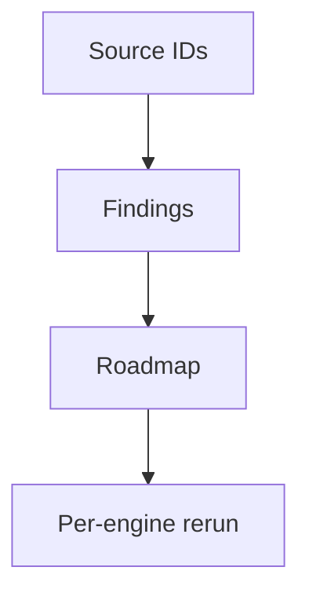

<!-- SPDX-License-Identifier: MIT -->
<!-- SPDX-FileCopyrightText: 2025-2026 Marcus Quinn -->

# LLM Visibility Toolbox

Evidence-based tactics for getting cited in ChatGPT, Perplexity, Gemini, Claude, AI Overviews, and AI Mode.

By [Marcus Quinn](https://github.com/marcusquinn).

::: report-cover
Internal toolkit · May 2026 · v4

**A Markdown-canonical playbook for AI search visibility.** Use it to turn source evidence, page-type weighting, and answer-engine behaviour into roadmap-ready recommendations.

Audience: SEO, content, engineering, and leadership teams. Export rule: one HTML preview; PDF profiles for A4, Letter, and 16:9 decks.
:::

## Executive summary {{badge:rct}}

LLM visibility is an evidence system, not a single checklist. The best programmes make priority pages retrieval-ready, criteria-complete, citation-worthy, technically fetchable, and corroborated by third-party sources. {{evidence:verified}}

Recommendations must be weighted by page type. A homepage, SaaS feature page, comparison page, pricing page, article, product page, local/YMYL page, and research asset need different tactics, owners, and verification paths. {{evidence:verified}}

::: badge-row
{{evidence:verified}} {{evidence:partial}} {{evidence:inferred}} {{evidence:missing}}
:::

::: stats-strip
::: kpi-card
**5**

Answer engines reported separately.
:::
::: kpi-card
**8**

Page types weighted before recommendations.
:::
::: kpi-card
**4**

Evidence strengths used in source ledgers.
:::
::: kpi-card
**1**

Canonical Markdown source.
:::
:::

::: badge-key
{{badge:rct}} Peer-reviewed or controlled comparison.

{{badge:strong}} Large independent primary-data study.

{{badge:vendor}} Vendor study with methodology and commercial incentives.

{{badge:practitioner}} Practitioner evidence or field report.

{{badge:hygiene}} Baseline technical implementation.
:::

::: accordion title="Changelog summary"
V4 adds schema-downgrade rationale, engine-specific reporting, source grouping, and diagram/equation fallbacks.
:::

::: action-line
**Operator action:** collect source IDs first, then interpret findings into recommendations with owners, acceptance criteria, and rerun steps.
:::

::: toc-list
Sources | Source ledger and evidence rules | appendices/source-ledger.md

Tactics | Highest-impact tactics and examples | weighted by page type

Matrix | Page-type matrix | required, conditional, avoid

Roadmap | Priority-card handoff | owner · effort · verification
:::

::: anchor-links
[Sources](#sources) [Tactics](#highest-impact-tactics) [Matrix](#page-type-matrix) [Roadmap](#roadmap-template) [Appendices](#appendices)
:::

## Highest-impact tactics

::: details-note

### Weight before recommending

Do not apply all tactics to all pages. Score page-type fit, retrieval eligibility, source proximity, corroboration, freshness, confidence, impact, and effort before roadmap sequencing.
:::

::: severity-key
::: info-panel severity=critical

### Critical

Revenue page cannot be fetched or cited.
:::
::: info-panel severity=high

### High

Claim lacks nearby evidence or source-card support.
:::
::: info-panel severity=medium

### Medium

Helpful page-type tactic with partial evidence.
:::
::: info-panel severity=low

### Low

Hygiene, formatting, or monitoring improvement.
:::
:::

::: facts-table-wrap

| Tactic | Evidence | Best page types | Why it matters | Verification |
|---|---|---|---|---|
| Direct-answer opening | {{evidence:verified}} | Article, glossary, comparison, feature, local | Concise first-paragraph claims are easier to retrieve and cite. | Rendered first 300 words include answer, source, and updated date |
| Source cards near claims | {{evidence:verified}} | Research, comparison, YMYL, feature | Engines need nearby proof to trust and quote claims. | Source ID appears beside factual claim and in ledger |
| Third-party corroboration | {{evidence:verified}} | SaaS, ecommerce, local, YMYL | Answer engines cross-check owned claims against outside sources. | Profile parity and source breadth review |
| Bot-friendly first fetch | {{evidence:verified}} | All priority pages | Hidden or blocked content cannot be cited. | Raw/rendered crawl, robots, sitemap, and logs |
| Entity consistency | {{evidence:partial}} | Homepage, about, local, profiles | Contradictory facts reduce answer confidence. | Canonical entity table and third-party parity |
| FAQPage schema | {{evidence:inferred}} | Hygiene only | Structured data helps clarity but does not replace visible evidence. | Schema validation plus visible-content check |

:::

## Page-type matrix

::: facts-table-wrap

| Page type | Required tactics | Conditional tactics | Devalue or avoid |
|---|---|---|---|
| Homepage | Entity facts, category clarity, proof, crawlable nav | Original stats, comparison links | Long FAQ as primary GEO tactic |
| SaaS feature | Criteria block, use cases, integrations, proof | Demo video transcript, benchmark table | Generic benefit copy without source IDs |
| Pricing | Plan facts, constraints, comparison table | Purchase-relevant visible FAQ | Hidden pricing screenshots only |
| Comparison | Direct answer, feature/pricing table, alternatives, source cards | Third-party review quotes | Unsupported “best” claims |
| Article/guide | Direct answer, question headings, stats, expert quotes | Glossary sidebar, summary box | Thin filler or stale facts |
| Product/PDP | Specs, reviews, availability, canonical descriptions | Video transcript, product schema | Flat B2B SaaS checklist |
| Local/YMYL | Credentials, service area, policies, disclaimers | Practitioner bios, local citations | Unsupported advice |
| Research/report | Methodology, dataset, source cards, findings | Embeddable charts | PDF-only content without HTML summary |

:::

::: industry-card

### Industry-fit reminder

SaaS, ecommerce, local, and YMYL pages require different proof sources. Map the page type before assigning a tactic.
:::

---

## Tactic card examples

::: tactic-card

### Direct-answer opening

- What: answer the query plainly in the first paragraph.
- Why: extractive systems need self-contained claims with nearby proof.
- How: pair answer, source ID, author/update date, and supporting table.
- Verify: rerun per-engine prompts and compare cited URL movement.
:::

::: impact-panel severity=high

### Impact

Direct-answer openings influence extraction quality, snippet usefulness, and the chance that a page is selected as a cited source.
:::

::: evidence-panel severity=medium

### Evidence

Verify with raw/rendered HTML, source-ID proximity, and per-engine prompt reruns.
:::

::: tactic-card

### Bot-friendly first fetch

- What: SSR or pre-render important content, allow relevant crawlers, and keep key text visible.
- Why: invisible or blocked content cannot be cited.
- How: compare raw HTML, rendered DOM, robots, sitemap, and logs.
- Verify: monthly crawl plus AI/search bot log review.
:::

::: good-bad
::: good-row

### Strong pattern

Direct answer, evidence badge, source ID, visible methodology, updated date, and crawlable comparison table.
:::
::: bad-row

### Weak pattern

Image-only proof, unsupported superlatives, client-rendered claims, and schema added without visible evidence.
:::
:::

## Myths and caveats

::: myth-callout

### Myth

Adding FAQPage schema is enough to become GEO-ready.

### Reality

FAQPage is hygiene unless visible FAQ content genuinely fits page type and query fan-out.
:::

::: example-card

```text
Worker brief: update /compare/example with source IDs S001-S004,
visible comparison evidence, third-party corroboration, and retest steps.
Acceptance: AIO, Gemini, ChatGPT, AI Mode, and Perplexity results are recorded separately.
```

:::

::: example-card



:::

Signal equation fallback: {{latex:AI\ visibility = retrieval + evidence + corroboration}}.

::: block-template title="Author block template"

```text
Written by Dr. Jane Doe, PhD
Principal Data Scientist, ExampleCo

Use this block for named experts, source credentials, and profile links.
```

:::

::: bar-chart
On-page evidence — 72%
Technical retrieval — 64%
Authority corroboration — 58%
:::

::: visibility-bars
AI Overviews — 78%

Gemini — 54%

ChatGPT — 41%

AI Mode — 38%

Perplexity — 9%
:::

> Strong reports separate observed facts from interpretation, then turn only verified or clearly labelled partial evidence into roadmap items.

## Case studies

::: case-study-card

### Industrial manufacturer

**Result:** measurable AI referral growth after direct-answer restructuring and third-party corroboration.

**Tactics applied:** original benchmarks, source-card evidence, bot-friendly rendering, and trade-publication mentions.
:::

::: case-study-card

### Healthcare comparison site

**Result:** cited answers appeared across multiple answer engines after visible expertise and profile parity fixes.

**Tactics applied:** practitioner bylines, review methodology, source-backed tables, and monthly prompt reruns.
:::

## Roadmap template

::: priority-group priority=high

### Priority rule

Start with revenue pages that fail retrieval eligibility or evidence proximity before optional schema enhancements.
:::

::: priority-card priority=critical

### Revenue page retrieval blocker

Use a priority card when a recommendation must carry priority, owner, due date, source IDs, and verification in one executive-scannable block. Pair with the source ledger and a worker-ready implementation brief.
:::

::: facts-table-wrap

| Priority | Recommendation | Applies to | Owner | Verification | Source IDs |
|---|---|---|---|---|---|
| P0 | Fix retrieval blockers on revenue pages. | Homepage, pricing, feature, PDP, local | SEO + engineering | Raw/rendered crawl, robots, sitemap, logs | S002, S005 |
| P1 | Add source cards and original evidence. | Comparison, article, research/report | Content + subject expert | Source ledger and citation checks | S001, S003 |
| P1 | Build third-party corroboration. | SaaS, local, ecommerce | Marketing/PR | Profile parity and source breadth | S004 |
| P2 | Improve schema and metadata. | All page types | SEO + engineering | Schema validation plus visible-content check | S002 |

:::

## Verification checklist

::: checklist-card

- Validate evidence badges and source IDs before export.
- Render HTML with the chosen DESIGN.md-backed template.
- Review table wrapping, badge visibility, source-card readability, and sticky TOC behaviour.
- Export A4/Letter PDF for documents and 16:9 PDF for decks.
- For client-custom reports, rerun live evidence collection before interpretation.
- For recurring reports, create a custom routine with deterministic collection and report-agent interpretation.
:::

## Closing callouts

::: callout

### Combined finding

AI visibility reporting should end with the fewest useful recommendations: retrieval blockers, evidence proximity, third-party corroboration, and monitoring. Keep panels for important emphasis; use plain bullets and tables for normal content.
:::

## Sources

::: sources-layout
::: sources-group
::: source-title
Primary sources
:::
::: source-card

### Prompt captures

AIO, Gemini, ChatGPT, AI Mode, and Perplexity prompt evidence stored separately.
:::
::: source-card

### Crawl evidence

Raw/rendered crawl export with retrieval eligibility notes.
:::
:::
::: sources-group
::: source-title
Corroboration sources
:::
::: source-card

### Third-party profiles

Review, directory, community, partner, and media source parity checks.
:::
:::
:::

::: facts-table-wrap

| Source ID | Evidence type | Use in report | Verification |
|---|---|---|---|
| S001 | Prompt capture | Per-engine citation presence | AIO, Gemini, ChatGPT, AI Mode, and Perplexity recorded separately |
| S002 | Raw/rendered crawl | Retrieval eligibility | Important claims visible on first fetch |
| S003 | Page inventory | Page-type weighting | URL mapped to homepage, feature, comparison, article, local, PDP, or report |
| S004 | Third-party profile | Corroboration strength | Facts match owned canonical entity table |
| S005 | Analytics/search data | Business value and priority | Priority URL cluster tied to demand or revenue |

:::

::: source-card

### Source-card rule

Every roadmap item should cite source IDs, observed date, confidence, owner, and the command or routine that verifies completion.
:::

::: privacy-note
**Public artifact rule**

Do not export private URLs, raw transcripts, screenshots, local paths, or client names. Publish source IDs and redacted summaries; keep raw evidence in approved secure storage.
:::

::: source-list
::: source-item

### Ahrefs controlled schema study

Schema is treated as technical hygiene rather than a primary AI-visibility growth lever.
:::
::: source-item

### Engine-overlap research

Low overlap between AIO, Gemini, ChatGPT, AI Mode, and Perplexity requires per-engine reporting.
:::
::: source-item

### Buyer-research evidence

Answer engines increasingly influence discovery and shortlisting, so reports separate visibility from conversion value.
:::
:::

::: accordion title="How source IDs become recommendations"
1. Capture source evidence before writing findings.
2. Map each source to supported claims and page types.
3. Score recommendations by impact, confidence, effort, and verification path.
4. Include unresolved gaps in the appendix rather than presenting them as facts.
:::

## Appendices

::: appendix-links
[Source ledger appendix](appendices/source-ledger.md) [Prompt set appendix](appendices/prompt-set.md) [Client audit example](../client-ai-search-audit/report.html) [Style previews](../style-previews/index.html)
:::

::: version-summary
V4 · compiled May 2026 from source-led evidence · internal toolkit
:::
