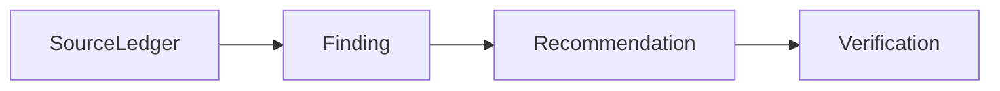

<!-- SPDX-License-Identifier: MIT -->
<!-- SPDX-FileCopyrightText: 2025-2026 Marcus Quinn -->

# Report Style Showcase

::: report-cover
**Component stress-test for DESIGN.md-backed report styles.** Render this same Markdown through different templates to compare typography, palette, spacing, borders, cards, tables, badges, code blocks, and print profiles.
:::

## Component overview {{badge:strong}}

Use [anchor links](#priority-and-checklist), [appendix links](../llm-visibility-toolbox/report.html), numbered steps, accordions, coloured panels, and source cards in the same canonical Markdown.

::: badge-row
{{evidence:verified}} {{evidence:partial}} {{evidence:inferred}} {{evidence:missing}}
:::

Evidence values should read as plain **Evidence:** text followed by a colour-coded mini badge for the value only.

::: stats-strip
::: stat-card
**34**

Renderer templates.
:::
::: stat-card
**16:9**

Slide PDF profile.
:::
::: stat-card
**A4**

Document PDF profile.
:::
::: stat-card
**MD**

Canonical source.
:::
:::

::: action-line
**Review pass:** compare sidebar behaviour, badge wrapping, table fit, and LottieFiles DM Sans rendering.
:::

::: anchor-links
[Table stress](#table-and-source-cards) [Cards](#cards-and-callouts) [Priority](#priority-and-checklist)
:::

---

## Highest impact, most validated

Use plain narrative and bullets when that is clearer than a panel. Panels are reserved for warnings, action blocks, source cards, or high-emphasis evidence.

::: tactic-card
### Earned media on third-party platforms {{badge:strong}}

Six converging studies point to third-party mentions as a stronger AI visibility signal than isolated owned-page edits.

- Build a quarterly cadence across trade press, community, video, and partner surfaces.
- Pair each campaign with source IDs and prompt reruns.
- Verify movement separately in AIO, Gemini, ChatGPT, AI Mode, and Perplexity.

::: action-line
**Action:** coordinate one trade article, one community thread, one video transcript, and one partner citation within the same quarter.
:::
:::

A plain bullet section should remain plain:

- Robots.txt and crawlability check for key AI bots.
- Render test with a representative answer-engine user agent.
- Schema audit on priority pages.
- Prompt list from Search Console, support tickets, and customer interviews.
- Baseline share of voice, citation rate, and sentiment per engine.

---

## Table and source cards

::: sources-layout
::: sources-group
::: source-title
Primary evidence
:::
::: source-card
### Source A
Prompt capture, crawl export, and source ledger row.
:::
::: source-card
### Source B
Third-party corroboration and profile parity note.
:::
:::
::: sources-group
::: source-title
Supplementary evidence
:::
::: source-card
### Source C
Appendix file, screenshot reference, or companion report.
:::
:::
:::

::: facts-table-wrap

| Component | Stress condition | Expected result |
|---|---|---|
| Evidence badge | Long table cell with badge {{evidence:verified}} | Badge stays readable and does not split words. |
| Facts table | Multiple columns with prose | Table remains usable in HTML and constrained in print. |
| Source card | Evidence note near claim | Card is visually distinct from normal paragraphs. |
| Sidebar | Many headings | Sticky TOC remains secondary to content and active link updates. |
:::

::: source-card
### Source sample

This card shows how evidence-led reports separate cited facts from interpretation.
:::

::: source-list
::: source-item
### Ahrefs: schema markup has no impact on AI visibility
1,885 vs 4,000 controls, difference-in-differences. Source used to downgrade schema from growth lever to hygiene.
:::
::: source-item
### Growth memo: the consensus gap
Only a small share of cited URLs overlap across engines; engine-specific reporting is required.
:::
::: source-item
### G2: the answer economy research
B2B buyers increasingly start with answer engines, so reports separate discovery, shortlist, and conversion evidence.
:::
:::

## Cards and callouts

::: info-panel severity=medium
### Info panel

Use info panels for caveats, assumptions, and reading guidance that should not become recommendations.
:::

::: impact-panel severity=high
### Impact panel

Use impact panels to show why a finding changes sequencing, budget, or ownership.
:::

::: evidence-panel severity=low
### Evidence panel

Use evidence panels for source IDs, collection method, confidence, and recheck commands.
:::

::: tactic-card
### Tactic card

- What: compact recommendation summary.
- Why: links action to evidence.
- How: gives implementation shape.
- Verify: names the acceptance check.
:::

::: good-bad
::: good-row
### Good row

Crawlable claims, source IDs, direct answers, and page-type weighting.
:::
::: bad-row
### Bad row

Unsupported claims, hidden content, generic tactics, and missing verification.
:::
:::

::: myth-callout
### Myth

Every page needs the same GEO checklist.

### Fact

Page type determines which tactics are useful, conditional, or noise.
:::

::: accordion title="How to read this document (evidence badges)"
Every tactic carries a badge. Use RCT/academic for controlled research, strong primary data for large independent data, vendor study where methodology exists but incentives are commercial, practitioner for field evidence, and hygiene for baseline technical work.
:::

::: accordion title="Key methodology caveat"
A visible uplift in one engine is not proof of universal AI visibility. Keep AIO, Gemini, ChatGPT, AI Mode, and Perplexity separate until the closing synthesis.
:::

> Quotes highlight expert evidence, user language, or a decision constraint without turning it into a recommendation.

::: example-card
```text
Render command:
.agents/scripts/report-render-helper.sh render report.md --template lottiefiles --pdf-profile slides-16-9-2 --output report.html
```
:::

::: example-card

:::

Inline LaTeX fallback: {{latex:visibility = citations + mentions + retrieval}}.

::: bar-chart
Citation readiness — 72%
Third-party corroboration — 58%
Retrieval eligibility — 81%
:::

## Case studies

Real before/after examples belong in simple cards because each card is a compact story, not a warning panel.

::: case-study-card
### Industrial manufacturer

**Result:** monthly AI referral traffic grew from near-zero to a measurable assisted-conversion channel.

**Tactics applied:** direct-answer page restructure, original technical benchmarks, schema hygiene, and trade-publication mentions.
:::

::: case-study-card
### Healthcare comparison site

**Result:** citations appeared across Google AIO, ChatGPT, and Gemini after entity facts and expert review were made visible.

**Tactics applied:** YMYL author bylines, source-backed comparison tables, third-party profile parity, and prompt reruns.
:::

---

## What does not work

::: callout
### SEO myths called out

Claims that circulate widely but cannot be traced to a primary source, or are contradicted by controlled evidence, should be called out explicitly.

**“Schema markup alone creates citation uplift.”** Contradicted by controlled or near-controlled studies; ship schema as hygiene.

**“Longer content always gets cited more.”** Engine-dependent; content depth helps only when it improves answer density and source usefulness.
:::

## Priority and checklist

::: priority-group priority=high
### High-priority visual checks

Review spacing, table width, no-wrap badges, active TOC highlighting, print CSS, and component contrast.
:::

::: checklist-card

- [x] Same Markdown renders across all templates.
- [ ] LottieFiles preview visibly prioritises DM Sans when the font is installed.
- [x] 16:9 PDF export is landscape.
- [x] HTML preview keeps one sidebar and one main report flow.
:::

::: appendix-links
[Source ledger appendix](../llm-visibility-toolbox/report.md) [Client audit example](../client-ai-search-audit/report.html) [Style preview index](style-previews/index.html)
:::


---

## Closing callouts

::: callout
### Combined finding

AI is now a discovery layer, but engines disagree on sources. Tracking only mentions or only citations misses the retrieval gap. Keep the final synthesis short, source-backed, and tied to the next action.
:::
