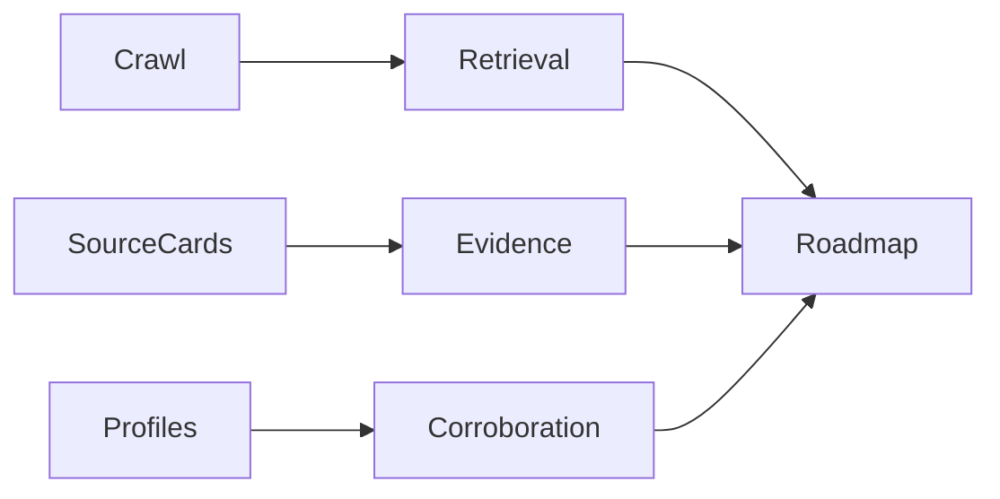

<!-- SPDX-License-Identifier: MIT -->
<!-- SPDX-FileCopyrightText: 2025-2026 Marcus Quinn -->

# LLM Visibility Toolbox Full Sample

::: report-cover
Internal toolkit · May 2026 · v4

**Full sample report for LLM visibility strategy, evidence collection, and report rendering.** This sample mirrors the richer Toolbox pattern: chapters, stats rows, tactical cards, source ledgers, callouts, accordions, appendices, links, quotes, checklists, and severity-coded panels.

Author: Marcus Quinn / aidevops. Licence: MIT. Export: one HTML preview plus PDF profiles.
:::

::: anchor-links
[Executive summary](#executive-summary) [Tactics](#on-page-content-tactics) [Technical](#technical-tactics) [Authority](#off-page-authority) [Appendices](#appendices)
:::

## Executive summary {{badge:strong}}

AI-search visibility improves when important pages are easy to retrieve, easy to trust, and easy to cite. Treat AIO, Gemini, ChatGPT, AI Mode, and Perplexity as separate evidence lines before summarising overall visibility. {{evidence:verified}}

::: summary-stats
::: stat-card
**5**

Answer engines tracked separately.
:::
::: stat-card
**7**

Evidence source families.
:::
::: stat-card
**4**

Severity levels for roadmap triage.
:::
::: stat-card
**3**

Appendix types linked from the report.
:::
:::

::: badge-key
{{badge:rct}} Peer-reviewed or controlled comparison.

{{badge:strong}} Large independent primary-data study.

{{badge:vendor}} Vendor study with methodology and commercial incentives.

{{badge:practitioner}} Practitioner evidence or field report.

{{badge:hygiene}} Baseline technical implementation.
:::

::: accordion title="Changelog summary"
V4 adds schema-downgrade rationale, engine-specific reporting, source grouping, and diagram/equation fallbacks.
:::

::: action-line
**Recommended sequence:** fix retrieval blockers, add source-backed answer blocks, then improve corroboration and monitoring.
:::

## How to read this report

1. Start with severity-coded panels and the source ledger.
2. Confirm the page type before applying a tactic.
3. Use accordions for methodology detail that should not interrupt the narrative.
4. Use appendices for source exports, prompt sets, and companion reports.

::: severity-key
::: info-panel severity=critical
### Critical
Citation or crawl failure on a revenue page.
:::
::: info-panel severity=high
### High
Evidence gap affecting important prompts.
:::
::: info-panel severity=medium
### Medium
Useful tactic with partial or page-type-specific fit.
:::
::: info-panel severity=low
### Low
Hygiene, monitoring, or presentation polish.
:::
:::

::: accordion title="Methodology summary"
Sources are captured first, assigned IDs, mapped to claims, and scored by page-type fit, confidence, impact, and effort. Unsupported claims remain in the appendix or backlog until verified.
:::

## Sources

::: sources-layout
::: sources-group
::: source-title
Prompt and crawl evidence
:::
::: source-card
### Prompt captures
Per-engine prompt exports show where the brand is cited, mentioned, inferred, or missing.
:::
::: source-card
### Crawl and logs
Raw/rendered crawl, robots, sitemap, and bot logs show retrieval eligibility.
:::
:::
::: sources-group
::: source-title
Authority evidence
:::
::: source-card
### Third-party corroboration
Review, community, media, partner, and profile sources verify claims outside owned pages.
:::
:::
:::

::: facts-table-wrap

| Source ID | Family | Evidence | Supported claim | Recheck |
|---|---|---|---|---|
| S001 | Prompt capture | AIO/Gemini/ChatGPT/AI Mode/Perplexity run | Per-engine reporting must stay separate | Monthly prompt routine |
| S002 | Crawl | Raw and rendered HTML comparison | JS-hidden claims are retrieval risk | Crawl after deployment |
| S003 | Source article | Public SEO/GEO research | Third-party corroboration matters | Quarterly source review |
| S004 | Logs | AI/search bot log sample | Bot access differs by page type | Monthly log review |
| S005 | Profile parity | Third-party profile table | Entity facts must match owned source of truth | Quarterly parity check |
:::

::: source-card
### Source-card standard
Include source ID, capture date, evidence type, supported claims, privacy state, and recheck path.
:::

::: source-list
::: source-item
### Controlled schema study
Use as a downgrade source when schema is presented as a standalone growth lever.
:::
::: source-item
### Engine-overlap evidence
Use to explain why answer engines are reported separately.
:::
::: source-item
### Buyer-research evidence
Use to connect visibility findings to discovery and shortlist behaviour.
:::
:::

---

## On-page content tactics

::: chapter-hero
### Goal
Make priority pages extractable and citation-ready with clear answers, source proximity, tables, and visible expertise.
:::

::: tactic-card
### Direct answer in the first paragraph
- What: answer the core query directly in two to four sentences.
- Why: answer engines need self-contained claims.
- How: pair answer, source ID, author/update date, and a supporting table.
- Verify: inspect rendered first 300 words and rerun per-engine prompts.
:::

::: impact-panel severity=high
### Impact
Direct answers can improve snippet quality, citation eligibility, and human comprehension.
:::

::: evidence-panel severity=medium
### Evidence
Evidence is strongest when prompt captures show cited URLs before and after implementation.
:::

::: good-bad
::: good-row
### Good
“ExampleCo is best for X when Y matters” followed by criteria, source IDs, and a dated comparison table.
:::
::: bad-row
### Bad
“Best platform for everyone” with no methodology, hidden content, or third-party corroboration.
:::
:::

## Technical tactics

::: tactic-card
### Bot-friendly first fetch
- What: put important claims in raw or pre-rendered HTML.
- Why: invisible content cannot be cited.
- How: compare raw HTML, rendered DOM, robots, sitemap, and logs.
- Verify: crawl after deployment and sample bot logs.
:::

::: facts-table-wrap

| Check | Risk if missing | Verification |
|---|---|---|
| Robots and AI crawler access | Pages cannot be fetched | robots.txt and server logs |
| SSR/pre-render | Key claims invisible | raw/rendered diff |
| Segmented sitemap | Slow discovery | sitemap audit |
| Stable entity graph | Conflicting facts | schema and visible facts check |
:::

::: example-card
```text
Acceptance check:
curl -L https://example.com/compare/example | grep "source-id"
Run browser crawl and compare rendered source-card visibility.
```
:::

::: example-card

:::

The report can include LaTeX-style formula fallbacks such as {{latex:score = impact * confidence / effort}} when the raw equation matters.

::: bar-chart
Retrieval readiness — 81%
Evidence proximity — 72%
Third-party corroboration — 58%
Monitoring coverage — 44%
:::

## Off-page authority

> Answer engines often corroborate owned claims against review sites, partner pages, communities, editorial mentions, transcripts, and public profiles.

::: action-panel severity=high
### Action
Create a profile parity table for product names, pricing, categories, service areas, credentials, and policy facts.
:::

::: myth-callout
### Myth
More schema can compensate for weak or unsupported content.

### Reality
Schema clarifies visible facts; it does not create trust when evidence is missing.
:::

## Case studies

::: case-study-card
### Industrial manufacturer

**Result:** AI referral traffic grew after the site added crawlable direct answers, technical benchmarks, and trade-publication corroboration.

**Tactics applied:** direct-answer opening, source cards, source-list review, and bot-friendly first fetch.
:::

::: case-study-card
### Healthcare comparison site

**Result:** citations appeared after visible expert review, comparison methodology, and third-party profile parity were added.

**Tactics applied:** YMYL author bylines, source-backed tables, profile parity, and prompt reruns.
:::

## Roadmap

::: facts-table-wrap

| Priority | Recommendation | Owner | Verification |
|---|---|---|---|
| P0 | Fix retrieval blockers on revenue pages. | SEO + engineering | Raw/rendered crawl and logs |
| P1 | Add source-backed answer blocks. | Content + subject expert | Source ledger and prompt reruns |
| P1 | Improve profile parity. | Marketing/PR | Third-party facts match canonical table |
| P2 | Add schema hygiene. | SEO + engineering | Schema validation plus visible-content check |
:::

## Closing callouts

::: callout
### Combined finding

Close with the smallest useful synthesis: what changed, what evidence proves it, what to do next, and how to verify it. Use panels only where emphasis helps the reader act.
:::

::: version-summary
V4 · compiled May 2026 from source-led evidence · internal toolkit
:::

## Appendices

::: appendix-links
[Source ledger appendix](appendices/source-ledger.md) [Prompt set appendix](appendices/prompt-set.md) [Example companion report](../../examples/client-ai-search-audit/report.html)
:::

::: checklist-card

- [x] Evidence badges validated.
- [x] Appendix links included.
- [x] Per-engine reporting kept separate.
- [ ] Replace placeholders with client evidence before publishing.
:::
