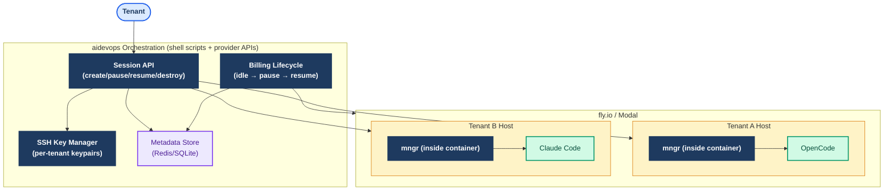

# t1879: SaaS Agent Hosting — Architecture Research

**Status:** Research complete  
**Source:** imbue-ai/mngr (MIT) — deep read of architecture, concepts, security model, provider backends, idle detection, snapshot, conventions, plugins  
**Date:** 2026-04-04  
**Audience:** aidevops SaaS roadmap — informs future implementation tasks

---

## Executive Summary

mngr is a single-user Unix-style agent manager built on SSH, git, and tmux. Its core patterns — convention-based state discovery, provider abstraction, idle detection via filesystem activity files, and snapshot/restore lifecycle — are directly applicable to aidevops SaaS hosting. The multi-tenant gap is real but bounded: mngr's per-host SSH key isolation, network allowlists, and pluggable provider backends give us the right primitives. The missing layer is a thin orchestration service that maps tenants to hosts and enforces billing boundaries.

**Recommendation:** Hybrid approach — use mngr as the per-container agent manager, build a lightweight multi-tenant orchestration layer on top. Do not fork; adopt as a dependency or use as a design reference for a shell-native reimplementation.

---

## 1. Process Management: tmux vs Alternatives

### How mngr uses tmux

mngr treats any process running in window 0 of a `mngr-`-prefixed tmux session as an agent. This is the entire agent definition — no daemon, no database, no registry. State is reconstructed by querying providers and SSH-ing into hosts to read filesystem conventions.

```
tmux session: mngr-<agent-name>
  window 0 → agent process (Claude Code, OpenCode, Codex, etc.)
  window 1+ → optional (debugging, services)
```

Agent state lives at `$MNGR_HOST_DIR/agents/<agent_id>/` — status files, activity files, logs, env vars.

### Comparison

| Dimension | tmux | systemd | supervisor/pm2 |
|-----------|------|---------|----------------|
| **Resource limits** | None (no cgroups) | Full cgroups | Limited |
| **Restart policy** | Manual | Native | Native |
| **Logging** | Pane capture + files | journald | Rotating files |
| **Attach/detach** | Native | Via `nsenter`/`screen` | Via `supervisorctl` |
| **Root required** | No | User units: no; system: yes | No |
| **Health checks** | Convention-based | Native | Native |
| **Snapshot-friendly** | Yes (process state in files) | Harder | Harder |
| **Universal** | Yes (macOS + Linux) | Linux only | Language-specific |
| **SaaS suitability** | MVP: yes; Production: limited | Production: yes | Not recommended |

**Assessment:** tmux is the right choice for MVP. It is universal, requires no daemon, and mngr's convention-based state model (activity files, status files) works well with it. For production, the path is: tmux for agent process management + cgroup-based resource limits applied at the container level (Docker/fly.io enforce these externally, so tmux's lack of cgroups is not a gap when running inside a container).

**Recommendation:** tmux for MVP. Container-level resource limits (Docker/fly.io) handle what tmux cannot. Revisit systemd for bare-VPS deployments at scale.

---

## 2. Provider Abstraction

### mngr's provider model

mngr separates **provider backends** (Docker, Modal, local, SSH) from **provider instances** (configured endpoints of a backend). The interface each backend must implement:

- `create_host()` — build image, allocate resources, start host
- `stop_host()` — stop host, optionally snapshot
- `start_host()` — restore from snapshot, restart
- `destroy_host()` — free all resources
- `snapshot_host()` — capture filesystem state (optional)
- `list_hosts()` — discover all mngr-managed hosts

State is stored in the provider itself (Docker labels, Modal tags, remote `data.json`) — not in a central mngr database. This is the key design insight: mngr is stateless; providers are the source of truth.

### Provider comparison for aidevops SaaS

| Provider | Isolation | Cost model | Snapshot | Startup | Network control | SaaS fit |
|----------|-----------|------------|----------|---------|-----------------|----------|
| **Hetzner Cloud** | Full VM | Hourly | Volume snapshots | ~30s | Firewall rules | Good for dedicated tenants |
| **fly.io** | Firecracker VM | Per-second | Machine pause/resume | ~2s | Private networks | Best for burst/idle workloads |
| **Modal** | gVisor sandbox | Per-second | Native incremental | ~2s | Offline/CIDR allowlist | Best for untrusted agents |
| **Docker (local)** | Container | Free | `docker commit` (slow) | ~1s | iptables | Dev/test only |
| **Docker (remote)** | Container | Varies | `docker commit` | ~1s | iptables | Small-scale SaaS |
| **Bare VPS (SSH)** | OS-level | Fixed | Manual | Varies | iptables | Budget option, ops-heavy |

**Recommendation for MVP:** fly.io Machines API. Reasons:
1. Per-second billing with native pause/resume maps directly to idle detection → billing stops
2. Firecracker VM isolation is stronger than Docker containers
3. Private networking between machines (tenant isolation without complex iptables)
4. 2-second cold start is acceptable for interactive sessions
5. `flyctl` CLI is scriptable; REST API is stable

**Recommendation for untrusted agents:** Modal sandboxes. gVisor isolation + network allowlists + external timeout enforcement (Modal's sandbox timeout cannot be bypassed by the agent). Use for agents that execute arbitrary user code.

### Interface design for aidevops

```python
class HostProvider(Protocol):
    def create_host(self, tenant_id: str, config: HostConfig) -> Host: ...
    def stop_host(self, host_id: str, snapshot: bool = True) -> None: ...
    def start_host(self, host_id: str) -> Host: ...
    def destroy_host(self, host_id: str) -> None: ...
    def list_hosts(self, tenant_id: str) -> list[Host]: ...
    def get_host_state(self, host_id: str) -> HostState: ...
```

This mirrors mngr's `provider_instance.py` interface. The key addition for SaaS: `tenant_id` scoping on all operations.

---

## 3. Idle Detection and Cost Control

### mngr's idle detection model

mngr uses filesystem activity files at `$MNGR_HOST_DIR/activity/` and `$MNGR_AGENT_STATE_DIR/activity/agent`. The file's **mtime** is the authoritative timestamp — agents `touch` the file to signal activity. An idle watcher script runs inside the host and checks mtimes against a configurable timeout.

**Idle modes** (from most to least permissive):

| Mode | Keeps host alive while... |
|------|--------------------------|
| `io` (default) | User input OR agent output OR SSH connected |
| `agent` | Agent producing output |
| `user` | User connected via SSH |
| `run` | Agent process alive |
| `create` | Within N seconds of agent creation |
| `disabled` | Never (immediate shutdown) |

**Security note:** mngr explicitly flags that activity files can be manipulated by a malicious agent. For untrusted agents, use `create` or `boot` mode + provider-level timeout enforcement (Modal's sandbox timeout, fly.io machine timeout).

### Mapping to SaaS billing

```
Agent active → host running → billing accrues
Agent idle (no output for N minutes) → host pauses → billing stops
User reconnects → host resumes → billing resumes
Idle timeout exceeded → host destroyed → session ends
```

**Implementation for aidevops:**

1. **Activity signal:** Agent writes to `$MNGR_HOST_DIR/activity/agent` on every output token. This is already how mngr_claude works.
2. **Idle watcher:** Shell script inside each container, polls activity file mtime every 30s. On idle: call provider API to pause/stop host.
3. **Billing boundary:** Pause = billing stops (fly.io native). Resume = billing resumes. Destroy = session ends, final invoice.
4. **Abuse prevention:** For untrusted agents, use provider-level max lifetime (fly.io: `--auto-stop`, Modal: `sandbox_timeout`). These cannot be bypassed from inside the container.

**Recommended idle timeouts:**
- Interactive session (user connected): 15 minutes of no user input
- Headless task: 5 minutes of no agent output
- Maximum session lifetime: 4 hours (configurable per plan tier)

---

## 4. Convention-Based State Discovery

### mngr's approach

mngr stores almost no persistent state. Everything is reconstructed from:
1. Provider queries (Docker labels, Modal tags, `data.json` on remote host)
2. SSH queries to hosts (tmux session list, process check, file reads)
3. Local config files

Naming conventions:
- tmux sessions: `mngr-<agent-name>`
- Host state dir: `~/.mngr/` (or `$MNGR_HOST_DIR`)
- Agent state: `$MNGR_HOST_DIR/agents/<agent_id>/`
- Activity files: `$MNGR_HOST_DIR/activity/<type>`
- Events: `$MNGR_HOST_DIR/events/` (JSONL)

**Pros:** No single point of failure. Multiple mngr instances can manage the same agents. Self-describing containers — SSH in and read state directly.

**Cons:** Discovery requires SSH to each host (slow at scale). No atomic cross-host queries. Race conditions possible without cooperative locking (mngr notes this as future work).

### For SaaS: thin metadata layer required

At single-user scale, convention-based discovery is sufficient. At SaaS scale (100s of tenants, 1000s of containers), SSH-based discovery is too slow for dashboard queries.

**Recommended hybrid:**

```
┌─────────────────────────────────────────────────────┐
│  Metadata Store (Redis or SQLite per region)         │
│  tenant_id → [host_id, state, last_activity, cost]  │
└─────────────────────────────────────────────────────┘
         ↑ written by                    ↑ read by
┌──────────────────┐            ┌──────────────────────┐
│  Idle watcher    │            │  Dashboard API        │
│  (inside host)   │            │  (tenant-facing)      │
└──────────────────┘            └──────────────────────┘
         ↑ ground truth
┌──────────────────────────────────────────────────────┐
│  Convention-based state (filesystem + provider tags)  │
│  (authoritative, used for reconciliation)             │
└──────────────────────────────────────────────────────┘
```

The metadata store is a cache/index, not the source of truth. Reconciliation runs periodically against provider APIs and SSH state. This is exactly how mngr works — we just add a caching layer for dashboard performance.

---

## 5. Multi-Tenant Security

### mngr's single-user security model

mngr's security is designed for a single trusted user:
- Per-host SSH keys (generated at host creation, stored locally)
- Network allowlists (`-b offline`, `-b cidr-allowlist=...`)
- Container isolation depends entirely on the provider (Docker: container; Modal: gVisor VM)
- Agents on the same host share all resources — no intra-host isolation

### Multi-tenant gaps and mitigations

| Gap | Mitigation |
|-----|-----------|
| Shared host between tenants | One host per tenant (never share hosts across tenants) |
| SSH key management at scale | Per-tenant SSH key pair, stored in secrets manager (Vault/gopass) |
| Credential injection | Environment variables injected at host creation, not stored in container filesystem |
| Network isolation | Provider-level private networks (fly.io private networking, Modal offline mode) |
| Audit trail | Per-tenant event log (JSONL in `$MNGR_HOST_DIR/events/`) + central audit store |
| Idle detection bypass | Provider-level max lifetime enforcement (cannot be bypassed from inside container) |
| Container escape | Use gVisor (Modal) or Firecracker (fly.io) for untrusted agents; Docker for trusted |
| Data residency | Provider region selection per tenant (fly.io: region flag; Modal: region config) |

**Key rule:** One host per tenant. Never share a host across tenant boundaries. mngr supports multiple agents per host — this is a cost optimization for single-user use. For SaaS, the isolation boundary is the host, so each tenant gets their own host.

### Credential injection pattern

```bash
# At host creation time (orchestration layer)
mngr create tenant-abc@.fly \
  --env-file /tmp/tenant-abc-secrets.env \  # injected, not stored
  --env ANTHROPIC_API_KEY="$TENANT_API_KEY" \
  --env TENANT_ID="abc"

# Inside container: agent reads from environment, never from filesystem
# Secrets are not written to disk
```

---

## 6. Snapshot/Restore Lifecycle

### mngr's snapshot model

mngr snapshots on stop, restores on start. Semantics are "hard power off" — in-flight writes may not be captured. Databases survive this (designed for power loss). Agent state (tmux session, work files, git state) is fully captured.

**Provider snapshot support:**

| Provider | Mechanism | Speed | Incremental | SaaS suitability |
|----------|-----------|-------|-------------|-----------------|
| Local | Not supported | — | — | Dev only |
| Docker | `docker commit` | Slow (full layer) | Relative to base image | Small scale |
| fly.io | Machine pause/resume | ~2s | Native (memory snapshot) | Good |
| Modal | Native sandbox snapshot | Fast | Fully incremental | Best |
| Hetzner | Volume snapshot | Minutes | No | Backup only |

### Billing implications

```
Snapshot = billing stops (compute freed)
Resume = billing resumes (compute allocated)
Destroy = snapshot deleted, session ends
```

fly.io's machine pause/resume is the closest to "billing pause" semantics — the machine is suspended in memory, not snapshotted to disk. Resume is ~2 seconds. This is the right primitive for interactive sessions where users expect fast resume.

For long-running headless tasks (hours), Modal's incremental snapshots are better — the task can be checkpointed and resumed without losing progress.

### Session persistence model for aidevops

```
User starts session → host created (or resumed from snapshot)
User active → host running, billing accrues
User idle 15min → host paused (fly.io: machine suspend), billing stops
User returns → host resumed in ~2s, billing resumes
User ends session → host destroyed, snapshot deleted
User returns next day → new host created (no persistence by default)
  OR
User has "persistent workspace" plan → snapshot retained, resumed on next login
```

---

## 7. Build vs Adopt vs Fork Analysis

### Option A: Adopt mngr as dependency

Use `imbue-mngr` as a Python package. Build the multi-tenant orchestration layer on top.

| Dimension | Assessment |
|-----------|-----------|
| **Effort** | Low upfront (pip install), medium integration |
| **Maintenance** | Low (upstream maintains mngr) |
| **Flexibility** | High (plugin system covers most extension points) |
| **Stack fit** | Poor (Python dependency; aidevops is shell-native) |
| **Multi-tenant** | Requires orchestration layer regardless |
| **Risk** | Upstream API changes; single-user assumptions in core |

**Verdict:** Viable if aidevops adds a Python service layer. Not viable for pure shell-native implementation.

### Option B: Fork mngr

Take mngr's codebase, rewrite multi-tenant parts, maintain the fork.

| Dimension | Assessment |
|-----------|-----------|
| **Effort** | High (fork + rewrite + ongoing maintenance) |
| **Maintenance** | High (diverges from upstream) |
| **Flexibility** | Maximum |
| **Stack fit** | Poor (still Python) |
| **Multi-tenant** | Full control |
| **Risk** | Maintenance burden; MIT license allows it |

**Verdict:** Not recommended. The maintenance burden of a Python fork is high, and the core value (provider abstraction, idle detection) can be reimplemented in shell in ~500 lines.

### Option C: Build own (shell-native, mngr-inspired)

Implement mngr's patterns in shell, tailored to aidevops's stack and multi-tenant requirements.

| Dimension | Assessment |
|-----------|-----------|
| **Effort** | Medium (2-3 weeks for MVP) |
| **Maintenance** | Low (shell scripts, no runtime dependencies) |
| **Flexibility** | Full control |
| **Stack fit** | Excellent (aidevops is shell-native) |
| **Multi-tenant** | Designed in from the start |
| **Risk** | Reimplementation risk; must test edge cases mngr already handles |

**Verdict:** Recommended for MVP. The core patterns are well-understood from mngr's docs. Shell implementation avoids Python dependency and integrates naturally with aidevops's existing helper scripts.

### Option D: Hybrid (recommended)

Use mngr as the **per-container agent manager** (installed inside each tenant container), build the **multi-tenant orchestration layer** in shell on top.

```
┌─────────────────────────────────────────────────────────────┐
│  aidevops SaaS Orchestration Layer (shell + provider APIs)   │
│  - Tenant → host mapping                                     │
│  - Billing lifecycle (create/pause/resume/destroy)           │
│  - SSH key management per tenant                             │
│  - Metadata store (Redis/SQLite)                             │
│  - Dashboard API                                             │
└─────────────────────────────────────────────────────────────┘
                          ↓ manages
┌─────────────────────────────────────────────────────────────┐
│  Per-tenant host (fly.io Machine / Modal Sandbox)            │
│  ┌─────────────────────────────────────────────────────┐    │
│  │  mngr (inside container)                            │    │
│  │  - Agent process management (tmux)                  │    │
│  │  - Idle detection (activity files)                  │    │
│  │  - Agent lifecycle (create/stop/start/destroy)      │    │
│  │  - Transcript access                                │    │
│  └─────────────────────────────────────────────────────┘    │
│  ┌─────────────────────────────────────────────────────┐    │
│  │  OpenCode / Claude Code / Codex (agent process)     │    │
│  └─────────────────────────────────────────────────────┘    │
└─────────────────────────────────────────────────────────────┘
```

**Why this works:**
- mngr handles what it's good at: agent process management, idle detection, tmux lifecycle
- The orchestration layer handles what mngr doesn't: tenant isolation, billing, SSH key management, metadata
- mngr is MIT licensed — no legal barrier
- mngr is already installed via `pip install imbue-mngr` — trivial to include in container image
- The orchestration layer is shell-native, consistent with aidevops's existing tooling

**Verdict: Recommended.** This is the lowest-risk path to MVP with the clearest upgrade path.

---

## 8. Recommended MVP Architecture



### Component responsibilities

| Component | Responsibility | Implementation |
|-----------|---------------|----------------|
| **Session API** | Create/pause/resume/destroy tenant sessions | Shell script + fly.io/Modal CLI |
| **Billing Lifecycle** | Poll metadata store, trigger pause on idle | Cron job or launchd plist |
| **SSH Key Manager** | Generate/store/rotate per-tenant SSH keypairs | gopass + shell helper |
| **Metadata Store** | Cache host state for dashboard queries | SQLite (MVP) → Redis (scale) |
| **mngr (in-container)** | Agent process management, idle detection | `pip install imbue-mngr` in Dockerfile |
| **Agent process** | The actual AI agent (OpenCode, Claude Code) | Configured by mngr |

### Data flow: session creation

```
1. Tenant requests session
2. Orchestration: generate SSH keypair for tenant
3. Orchestration: call fly.io API → create Machine with tenant env vars
4. Machine starts: mngr installed, agent process launched in tmux
5. Orchestration: write host_id, tenant_id, state=running to metadata store
6. Tenant: SSH tunnel or web terminal (ttyd) to agent
```

### Data flow: idle detection and billing pause

```
1. Agent writes to $MNGR_HOST_DIR/activity/agent on each output token
2. mngr idle watcher (inside container): polls activity file mtime every 30s
3. After 15min idle: mngr calls orchestration webhook OR writes to event file
4. Orchestration: call fly.io API → suspend Machine (billing stops in ~2s)
5. Orchestration: update metadata store → state=paused
6. Tenant reconnects: orchestration resumes Machine (~2s), updates metadata
```

---

## 9. Implementation Effort Estimate

| Phase | Effort | Deliverable |
|-------|--------|-------------|
| **P1: Container image** | 1 week | Dockerfile with mngr + OpenCode + sshd + ttyd |
| **P2: Orchestration scripts** | 2 weeks | Session create/pause/resume/destroy shell helpers |
| **P3: SSH key management** | 3 days | Per-tenant keypair generation + gopass storage |
| **P4: Metadata store** | 3 days | SQLite schema + read/write helpers |
| **P5: Billing lifecycle** | 1 week | Idle detection webhook + pause/resume automation |
| **P6: Dashboard API** | 2 weeks | REST API over metadata store (tenant session status) |
| **P7: Web terminal** | 1 week | ttyd integration + auth proxy |
| **Total MVP** | **~8 weeks** | Single-tenant-per-host SaaS with billing lifecycle |

---

## 10. Open Questions for User Decision

1. **Provider choice:** fly.io (fast resume, per-second billing, Firecracker isolation) vs Modal (gVisor isolation, better for untrusted code, Python-native). Can be both — fly.io for interactive sessions, Modal for headless tasks.

2. **Persistence model:** Should tenant workspaces persist between sessions (snapshot retained) or be ephemeral (destroyed on session end)? Persistent = storage cost; ephemeral = simpler billing.

3. **Agent type:** OpenCode is the current runner. Should the SaaS layer support multiple agent types (Claude Code, Codex, custom) via mngr's plugin system, or lock to OpenCode for MVP?

4. **Web terminal vs SSH:** ttyd provides a browser-based terminal (no SSH client needed). SSH is more powerful but requires client setup. Both can coexist — ttyd for casual users, SSH for power users.

5. **Billing model:** Per-second compute (pass-through from fly.io/Modal) vs flat subscription with compute budget. The idle detection infrastructure supports either model.

6. **Multi-region:** Single region for MVP or multi-region from day one? fly.io makes multi-region straightforward (region flag at Machine creation). Data residency requirements may force this decision.

---

## References

- mngr source: https://github.com/imbue-ai/mngr/ (MIT)
- mngr architecture: `libs/mngr/docs/architecture.md`
- mngr concepts: `libs/mngr/docs/concepts/` (agents, hosts, providers, idle_detection, plugins, provisioning, snapshot)
- mngr security model: `libs/mngr/docs/security_model.md`
- mngr conventions: `libs/mngr/docs/conventions.md`
- mngr provider backends: `libs/mngr/docs/concepts/provider_backends.md`
- fly.io Machines API: https://fly.io/docs/machines/
- Modal sandboxes: https://modal.com/docs/guide/sandboxes
- aidevops headless dispatch: `.agents/scripts/headless-runtime-helper.sh`
- aidevops pulse: `.agents/scripts/commands/pulse.md`
